# Introduction

In today's digital landscape, the importance of robust cyber security
measures cannot be overstated. Cyber threats are becoming increasingly
sophisticated, and organizations must be vigilant in monitoring and
detecting potential breaches to protect their assets and data. This
project aims to provide a comprehensive lab environment for learning and
experimenting with various cyber security monitoring and detection
techniques.

The Cyber Security Monitoring & Detection lab is designed to simulate a
real-world network environment using VMware Workstation Pro. By setting
up and configuring multiple virtual machines, each playing a distinct
role within the network, users can gain hands-on experience with key
security tools and practices. The lab includes components such as
firewalls, intrusion detection systems, log management solutions, and
attacker simulations to provide a holistic understanding of cyber
security operations.

# Network Topology Diagram

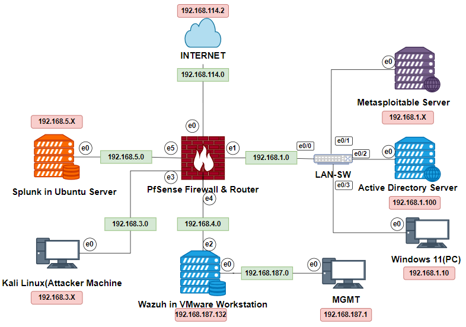

## Key Features

- **Real-time Threat Detection**: Implement tools that provide
  continuous monitoring and alerting of potential threats.

- **Automated Incident Response**: Configure automated responses to
  detected threats to minimize damage and speed up recovery.

- **Network Traffic Analysis**: Analyse network traffic to identify
  suspicious activities and potential breaches.

- **User Activity Monitoring**: Track and monitor user activities to
  detect unauthorized access and insider threats.

- **Integration with SIEM Systems**: Centralize and analyse security
  data from multiple sources using a Security Information and Event
  Management (SIEM) system.

- **Anomaly Detection using Machine Learning**: Use machine learning
  models to identify unusual patterns and behaviours indicative of cyber
  threats.

## System Requirements

**Hardware**

- **Processor**: Multi-core CPU (e.g., Intel i5/i7, AMD Ryzen)

- **Memory**: Minimum 16 GB RAM (32 GB recommended)

- **Storage**: Minimum 250 GB free disk space (SSD preferred)

## Software

- **VMware Workstation Pro**: For creating and managing virtual machines

- **ISO/VMDK Files**: Various operating systems and security tools

  - **pfSense**: Firewall and router

  - **Windows 11**: User workstation

  - **Server 2019**: Active Directory controller

  - **Kali Linux**: Attacker machine

  - **Wazuh**: Network security monitoring

  - **Metasploitable**: Vulnerable machine for testing

  - **Ubuntu Server with Splunk**: Log management

## Network Configuration and VM Details

### Firewall and VM Images

| **Component**  | **Details**                        |
|----------------|------------------------------------|
| pfSense        | pfSense-CE-2.6.0-RELEASE-amd64.iso |
| PC1            | Win11 x64 Pro 2022.iso             |
| ADC Server     | Server 2019 En Jun 2020.iso        |
| Kali Linux     | kali-linux-2023.2.vmdk             |
| Wazuh          | Wazuh-4.4.4.ovf                    |
| Metasploitable | Metasploitable 2.vmdk              |
| Splunk         | Ubuntu Server 22.10 (64bit).vmdk   |

### IP Address Assignments

| **Category**                | **Subnet / Address** |
|-----------------------------|----------------------|
| External Subnet             | 192.168.114.0/24     |
| Internal LAN Subnet         | 192.168.1.0/24       |
| Attacker Subnet             | 192.168.3.0/24       |
| Wazuh Logs Subnet           | 192.168.187.0/24     |
| Splunk Log Collector Subnet | 192.168.5.0/24       |
| SPAN Port IP Address        | No IP Address        |

### Specific IP Addresses

| **Component**  | **IP Address**   |
|----------------|------------------|
| Metasploitable | Through DHCP     |
| ADC Server     | 192.168.1.100    |
| PC1            | 192.168.1.10     |
| Attacker       | Through DHCP     |
| Splunk         | Through DHCP     |
| Wazuh          | 192.168.187.0    |
| DNS Servers    | 8.8.8.8, 4.4.4.4 |

### VMware Adopter Network Connections and Roles

| **Network Adopter** | **Network Connection** | **Role**          |
|---------------------|------------------------|-------------------|
| NAT WAN             | EM0                    | Network Adopter   |
| VMNet2 LAN          | EM1                    | Network Adopter 2 |
| VMNet3 SPAN         | EM2                    | Network Adopter 3 |
| VMNet4 KALI         | EM3                    | Network Adopter 4 |
| NAT WAZUH           | EM4                    | Network Adopter   |
| VMNet6 SPLUNK       | EM5                    | Network Adopter 6 |

### IP Subnet and Network Connection Roles for pfSense

| **IP Subnet**    | **Network Connection** | **Role** | **PfSense Interface** |
|------------------|------------------------|----------|-----------------------|
| 192.168.114.0/24 | NAT WAN                | EM0      | Network Adopter       |
| 192.168.1.0/24   | VMNet2 LAN             | EM1      | Network Adopter 2     |
| No IP Address    | VMNet3 SPAN            | EM2      | Network Adopter 3     |
| 192.168.3.0/24   | VMNet4 KALI            | EM3      | Network Adopter 4     |
| 192.168.187.0/24 | NAT WAN WAZUH          | EM4      | Network Adopter 5     |
| 192.168.5.0/24   | VMNet6 SPLUNK          | EM5      | Network Adopter 6     |

# Lab Environment Overview

The lab environment consists of several virtual machines interconnected
within a VMware Workstation Pro setup. Each virtual machine serves a
specific purpose within the network:

- **pfSense Firewall**: Acts as the primary firewall to control and
  monitor network traffic.

- **Windows 11**: Represents a standard user workstation.

- **Active Directory Controller**: Manages user authentication and
  authorization.

- **Kali Linux**: Used as an attacker machine to simulate cyber attacks.

- **Wazuh**: Provides network security monitoring, intrusion detection,
  and log management.

- **Metasploitable**: A vulnerable machine used to test penetration and
  exploit scenarios.

- **Splunk**: Serves as a centralized log management solution,
  collecting and analyzing logs from various sources.

# Getting Started

## Installing VMware Workstation

1.  **Download VMware Workstation Pro**: [VMware Workstation Pro
    Download](https://www.vmware.com/mena/products/workstation-pro/workstation-pro-evaluation.html)

> 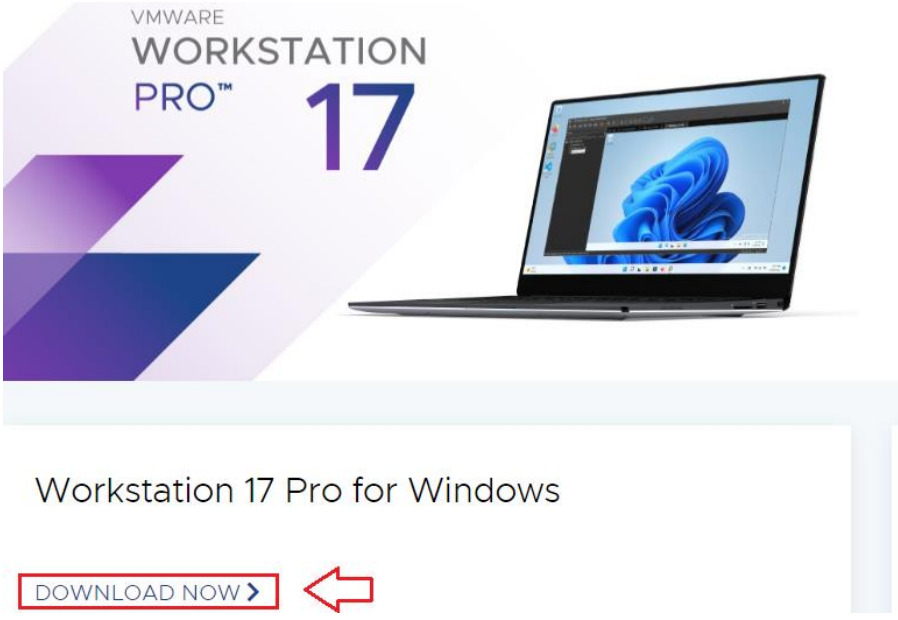 alt="A computer with a picture of a picture on it Description automatically generated" />

2.  **Install VMware Workstation Pro**:

    - Run the VMware Workstation Pro installer.

> 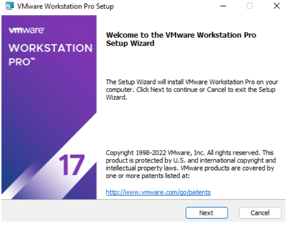 alt="A screenshot of a computer Description automatically generated" />

- Follow the setup wizard, accept the license agreement, and choose
  installation options as required.

> 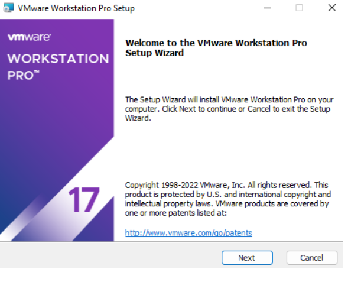 alt="A screenshot of a software Description automatically generated" />
>
> 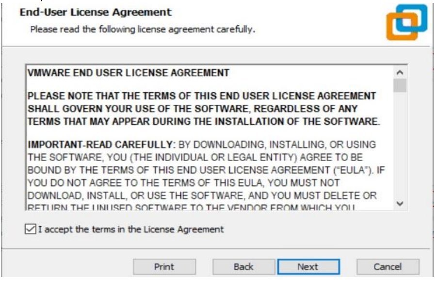 alt="A screenshot of a software agreement Description automatically generated" />

- Select Installation Folder: Choose the default folder.

- Enhanced Keyboard Driver: Check the box.

> 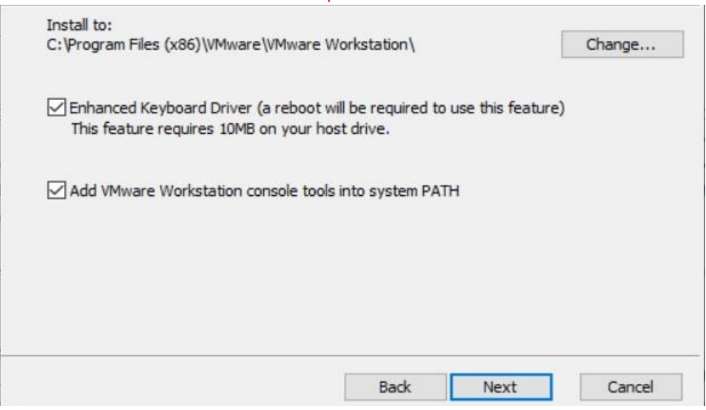 style="width:5.67708in;height:3.55208in" />

- Check for Updates & Help Improve: Choose as you prefer (default is
  unchecked).

> 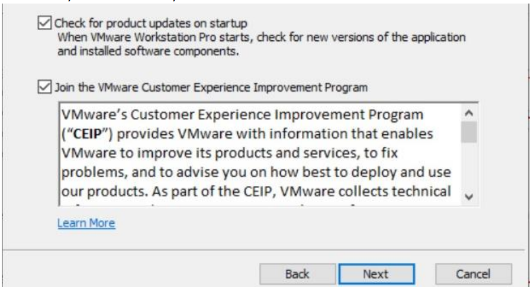 style="width:5.57292in;height:3.27083in" />

- Shortcut Icons: Select both Desktop and Start Menu.

>  alt="A screenshot of a computer program Description automatically generated" />

- Begin Installation: Click Install.

> 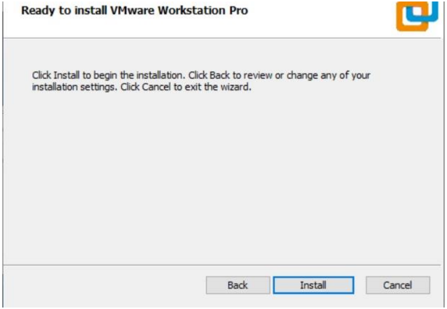 alt="A screenshot of a computer Description automatically generated" />

- Below screenshot shows Installation in progress. Wait for this to
  complete.

> 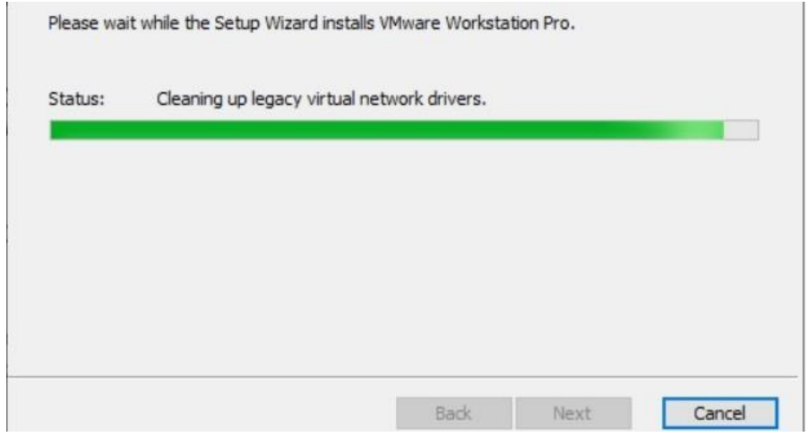 alt="A screenshot of a computer Description automatically generated" />

- Configure network adapters to obtain IP addresses automatically and
  disable IPv6 for VMnet1 and VMnet8.

> 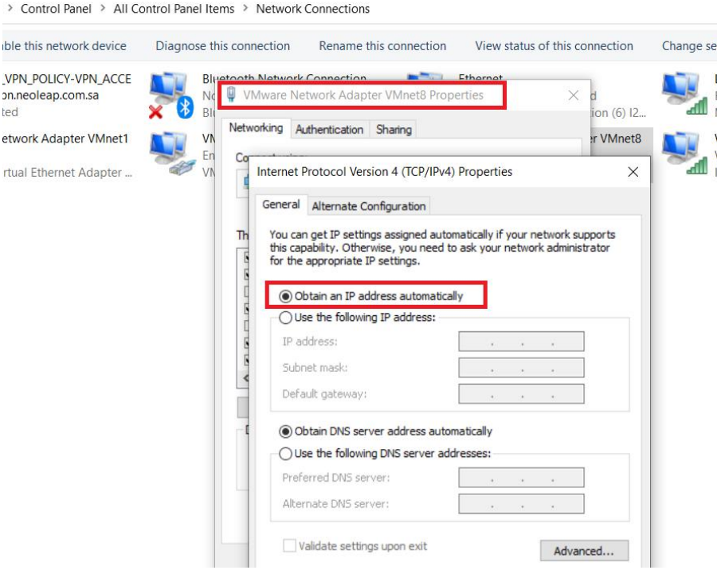 alt="A screenshot of a computer Description automatically generated" />
>
> 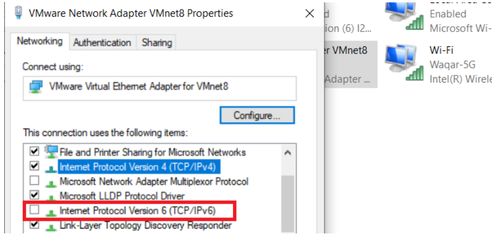 alt="A screenshot of a computer Description automatically generated" />

## Creating and Configuring Virtual Machines

### Creating a New Virtual Machine

1.  Download the Windows 11 ISO from [Microsoft's official
    website](https://www.microsoft.com/en-gb/software-download/windows11).

> 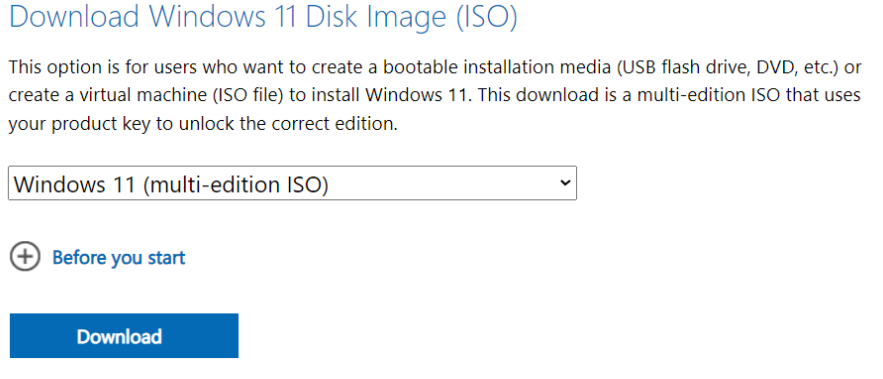 alt="A screenshot of a computer Description automatically generated" />

2.  Open VMware Workstation and click **Create a New Virtual Machine**.

3.  In the wizard, select **Typical (recommended)**.

> 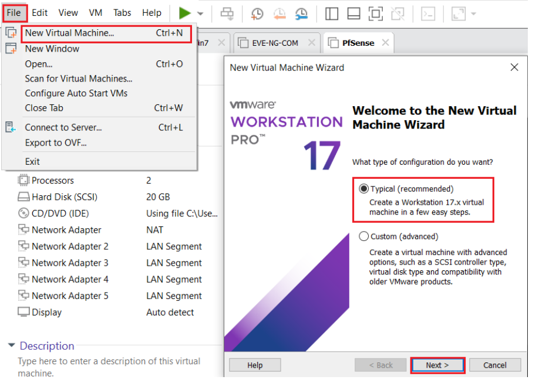 alt="A screenshot of a computer Description automatically generated" />

4.  Browse to where you saved the Windows 11 ISO file and click
    **Next**.

5.  Enter a password for the Trusted Platform Module (TPM) and click
    **Next**.

> 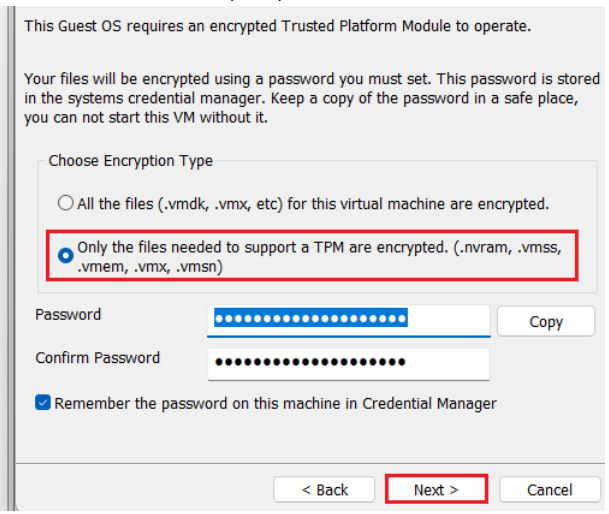 alt="A screenshot of a computer Description automatically generated" />

6.  Accept the default disk configuration by clicking **Next**.

> 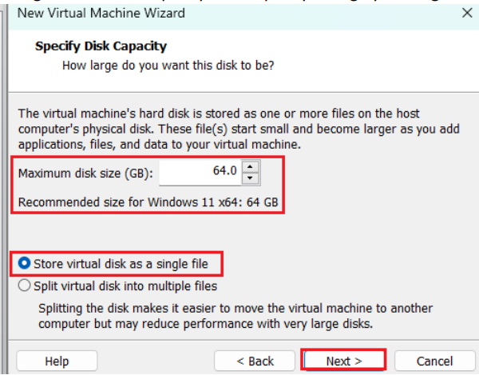 style="width:6.07653in;height:3.64392in" />

7.  Click **Finish** to start the new VM and begin the Windows
    installation process.

> 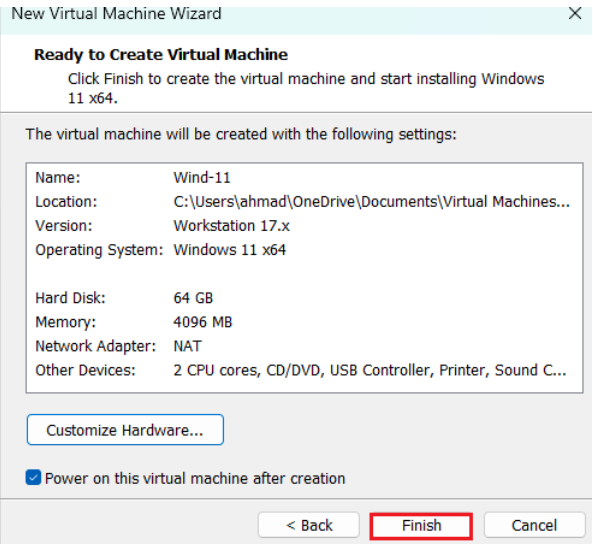 alt="A screenshot of a computer Description automatically generated" />

# Windows 11 Installation in VMware Workstation

1.  Boot the VM from the virtual DVD ROM drive where your downloaded ISO
    file is attached. If you don’t manage in time, shut down the VM and
    start it again.

> 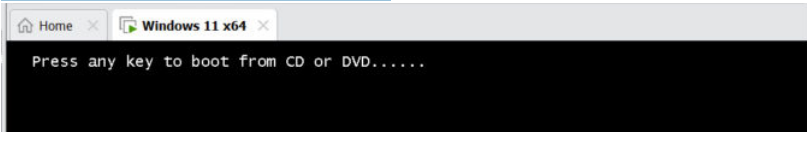 alt="A black and white screen with white text Description automatically generated" />

2.  Select the language, time, and keyboard settings and click **Next**.

> 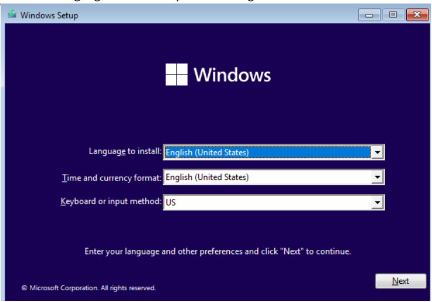 alt="A screenshot of a computer Description automatically generated" />

3.  Click **Install Now**.

> 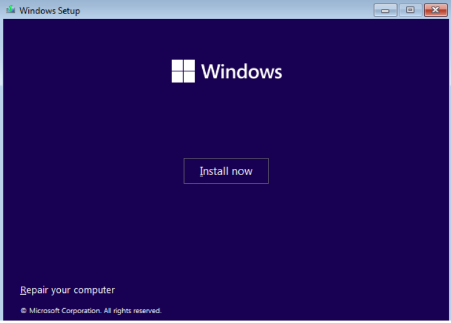 alt="A screenshot of a computer Description automatically generated" />

4.  Click on **I don’t have the product key** if you want to register
    later.

> 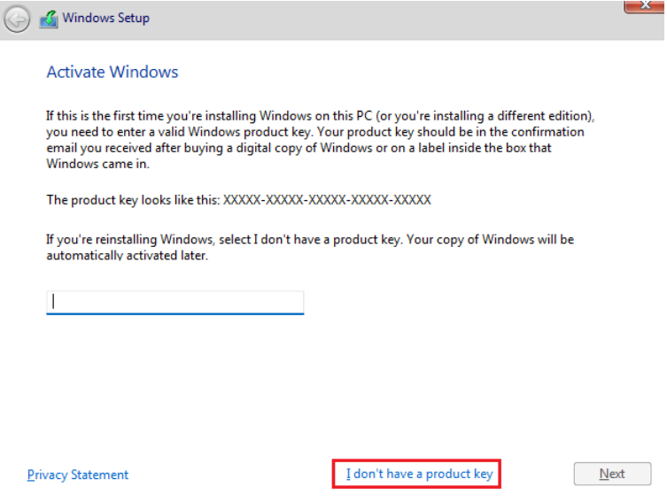 alt="A screenshot of a computer Description automatically generated" />

5.  Select the version you want to install and click **Next**.

> 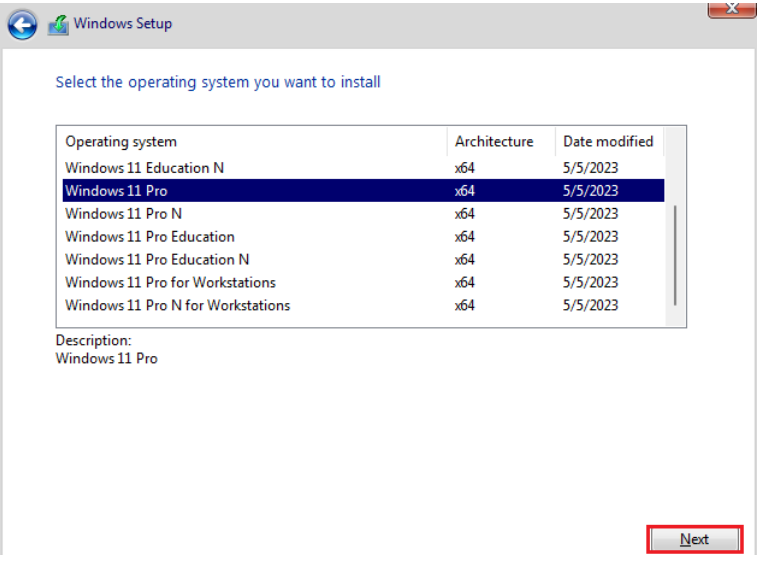 alt="A screenshot of a computer Description automatically generated" />

6.  Accept the License Agreement and click **Next**.

> 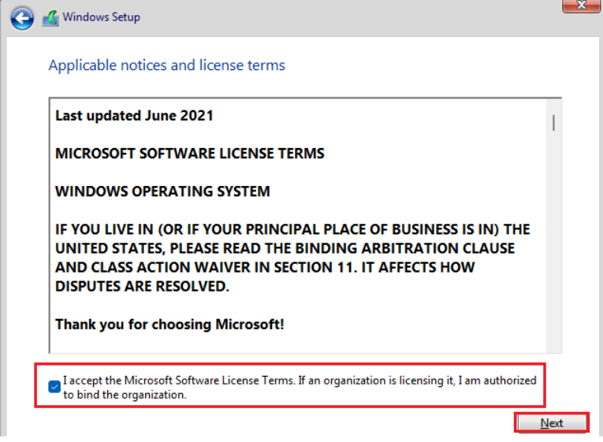 style="width:6.11458in;height:2.72917in" />

7.  Select custom installation and choose the installation disk.

> 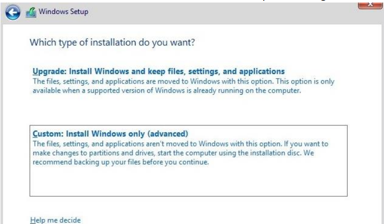 style="width:6.10835in;height:2.70336in" />
>
>  alt="A screenshot of a computer Description automatically generated" />

8.  Follow the on-screen instructions to complete the installation.

# Installing Security Tools

## pfSense Firewall

### Download and Decompress

- Download pfSense-CE-2.6.0-RELEASE-amd64.iso.gz. Get ISO file from

> <https://www.pfsense.org/download/>
>
> 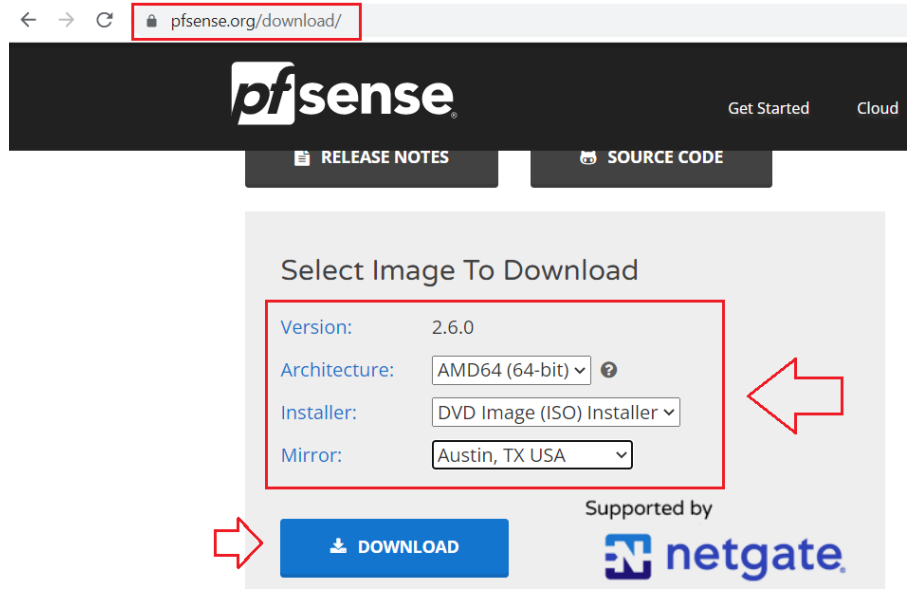 alt="A screenshot of a computer Description automatically generated" />

- Use 7-zip to decompress the .gz file to get the ISO. Get 7-zip from
  <https://www.7-zip.org/download.html>

> 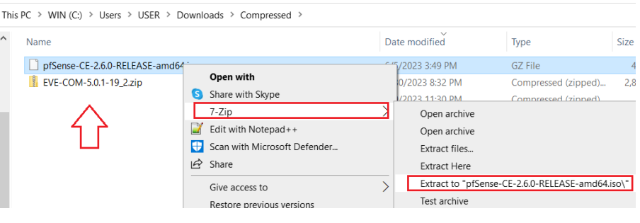 alt="A screenshot of a computer Description automatically generated" />

### VMware Setup:

- Open VMware and create a new virtual machine.

> 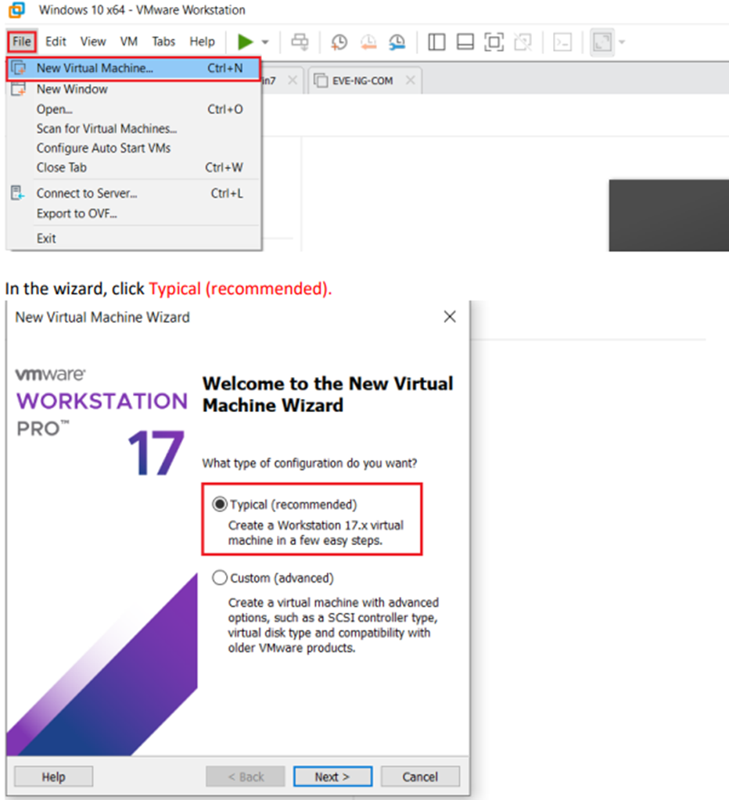 style="width:5.5625in;height:5.23958in" />

- Select the pfSense ISO as the installer disc image file.

> 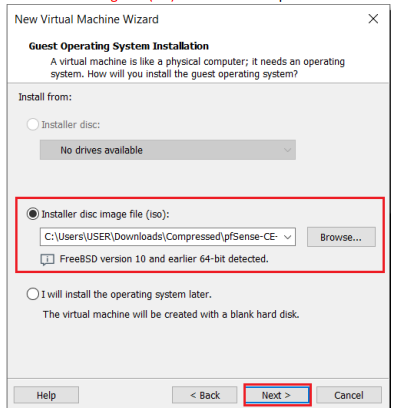 alt="A screenshot of a computer Description automatically generated" />

- Name the VM pfSense and choose a storage location.

>  alt="A screenshot of a computer Description automatically generated" />

- Store the virtual disk as a single file with a maximum size of 20GB.

> 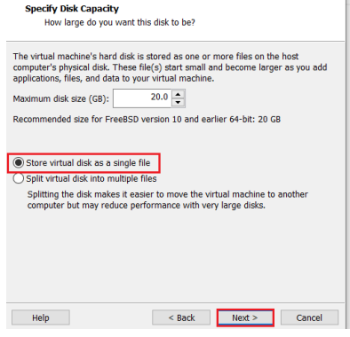 alt="A screenshot of a computer Description automatically generated" />

### Customize Hardware:

- Click "Customize Hardware".

> 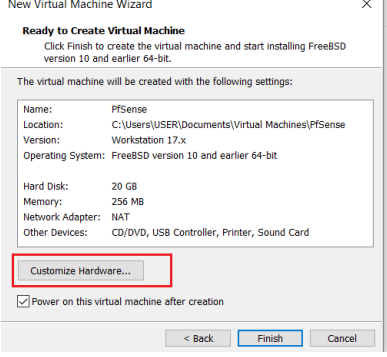 alt="A screenshot of a computer Description automatically generated" />

- Add 5 network adapters for a total of 6, mapping each to a VMnet
  interface (e.g., Network Adapter 2 to VMnet2, etc.).

>  alt="A screenshot of a computer Description automatically generated" />

- Remove unnecessary components like the USB controller and sound card.

### Network Configuration:

- Configure each network adapter to use a specific virtual network
  (VMnet) from the drop-down menu.

| Adopter Number  | VMnet  |      Segment      |
|:---------------:|:------:|:-----------------:|
| Network Adapter |  NAT   |        WAN        |
| Network Adapter | VMnet2 |        LAN        |
| Network Adapter | VMnet4 | KALI LINUX ATTACK |
| Network Adapter |  NAT   |       WAZUH       |
| Network Adapter | VMnet6 |   SPLUNK SERVER   |

- Click OK to save changes.

### Install pfSense:

- Proceed with the installation and select OK.

> 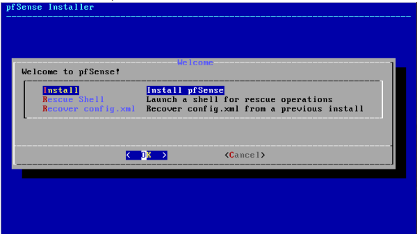 alt="A screenshot of a computer Description automatically generated" />

- On the Keymap Selection screen, press Enter to continue with the
  default keymap.

> 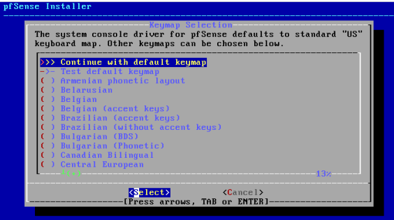 alt="A screenshot of a computer Description automatically generated" />

- Select Auto ZFS file system and click OK.

> 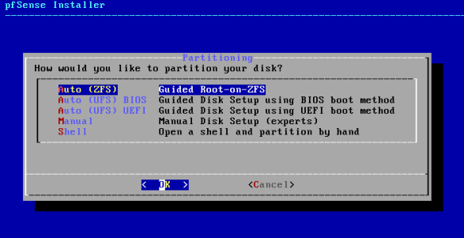 alt="A screenshot of a computer Description automatically generated" />

- Click Install and hit Enter to continue.

> 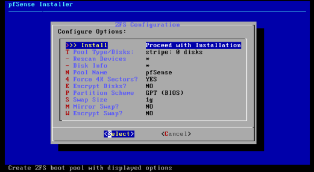 alt="A screenshot of a computer Description automatically generated" />

- Choose the default Stripe with no redundancy and click OK.

> 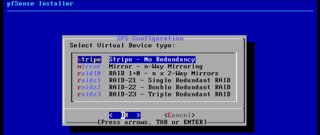 alt="A computer screen shot of a computer Description automatically generated" />

- Select the disk for installation and press Tab to choose Yes, then
  Enter to continue.

>  alt="A screenshot of a computer Description automatically generated" />

### Complete Installation:

- Wait for the installation to complete.

- When prompted, select No to skip the shell configuration.

> 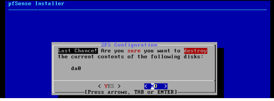 alt="A computer screen with a blue and black box Description automatically generated" />

- After completion, setup will give you the option to open a shell to
  modify your configuration. Select No and proceed.

> 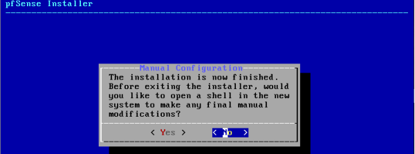 alt="A computer screen with text Description automatically generated" />

- Reboot the machine.

> 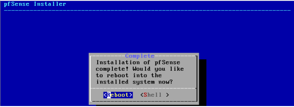 alt="A screenshot of a computer Description automatically generated" />

### Post-Installation:

- After reboot, the pfSense LAN interface gets the default IP address
  192.168.1.1/24.

- The WAN interface (em0) gets a different IP address (e.g.,
  192.168.114.139/24).

> 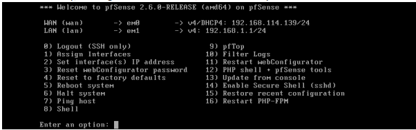 alt="A screenshot of a computer Description automatically generated" />

### PfSense Firewall Initial Configuration:

1.  Interface Mappings:

- After reboot, press 1 to create interface mappings.

- When asked "Should VLANs be set up now?", type n.

> 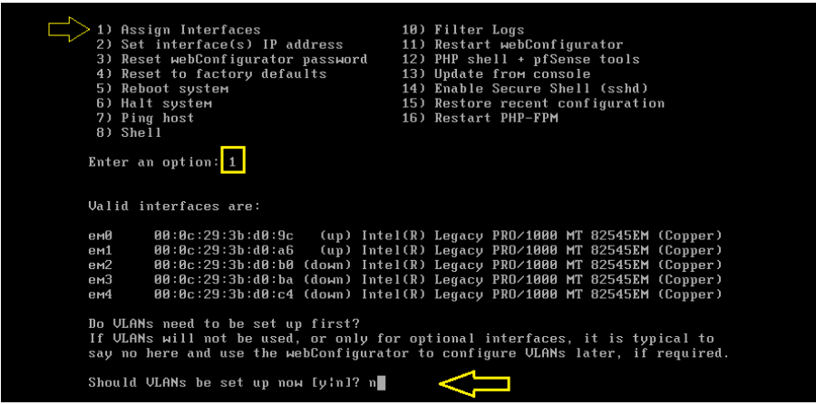 alt="A screenshot of a computer Description automatically generated" />

- Assign interface names as prompted.

> 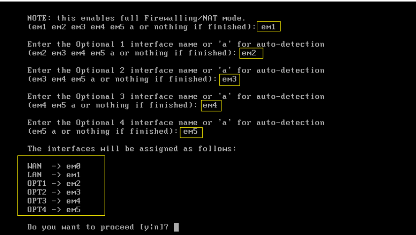 alt="A screenshot of a computer program Description automatically generated" />

### Configure Interface IP Addresses:

- Enter 2 at the pfSense menu.

- Enter the IP address number of the interface to configure.

- Assign each adapter its own /24 subnet.

> 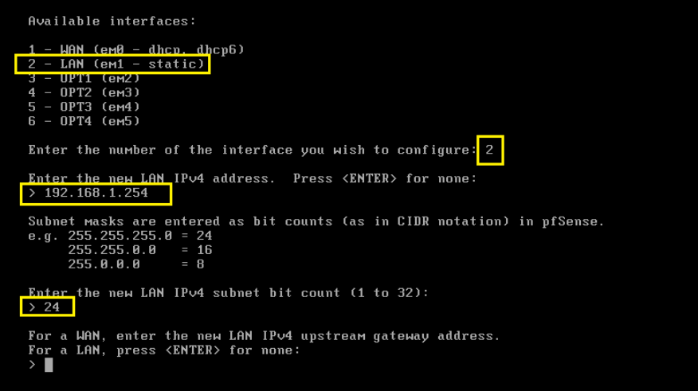 alt="A screenshot of a computer Description automatically generated" />

### Enable WebConfigurator:

- Enable the webConfigurator protocol to access the firewall via a
  browser.

> 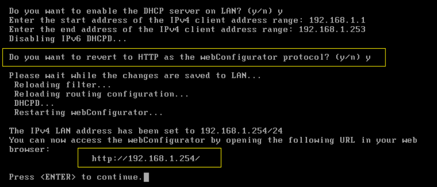 alt="A screenshot of a computer Description automatically generated" />

### Set IP Addresses:

- For OPT2 (em3): Set the IP address.

> 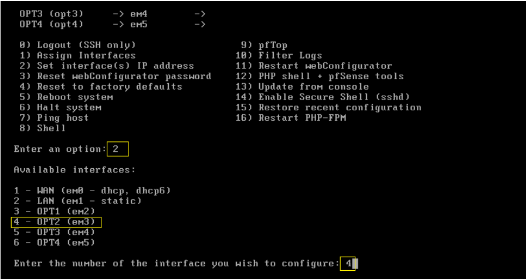 alt="A screenshot of a computer Description automatically generated" />
>
> 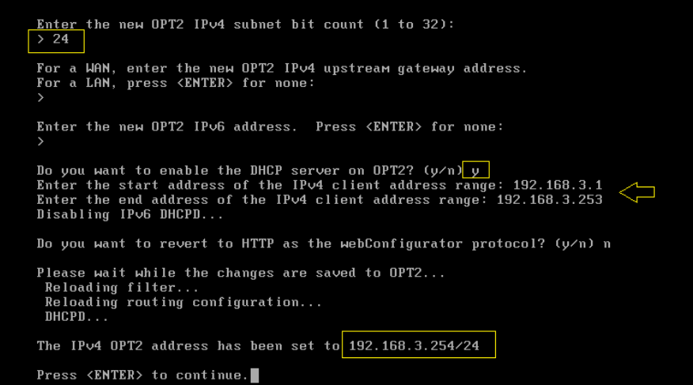 alt="A screenshot of a computer Description automatically generated" />

- For OPT3 (em4): Set the IP address.

> 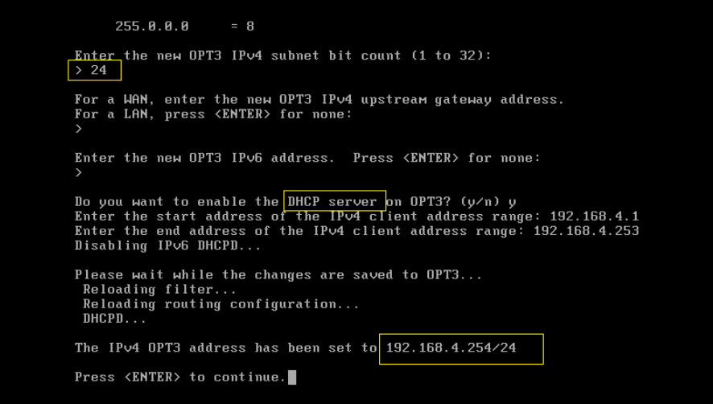 alt="A screenshot of a computer Description automatically generated" />

- For OPT4 (em5): Set the IP address.

> 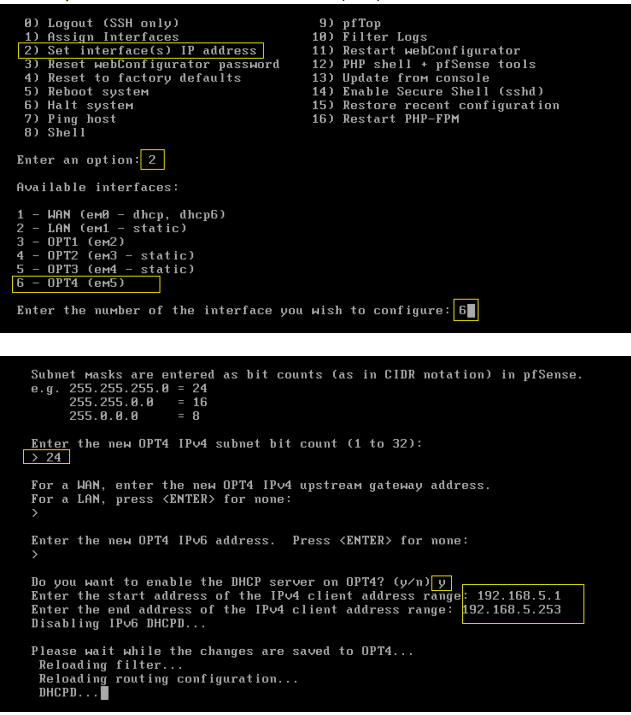 alt="A screenshot of a computer Description automatically generated" />

### Adapter IP Assignments:

- em0 (WAN): IP received via DHCP.

- em1 (LAN): IP 192.168.1.254.

- em2: Leave as SPAN port for traffic monitoring.

- em3 (KALI): IP 192.168.4.254.

- em4 (Wazuh): IP received via DHCP.

- em5 (Splunk): IP 192.168.5.254.

> 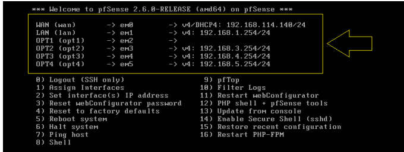 alt="A screenshot of a computer Description automatically generated" />

### PfSense Firewall Configuration

1.  **Setup Access:**

    - Access the pfSense Web Configurator via a browser at
      <http://192.168.1.254>.

> 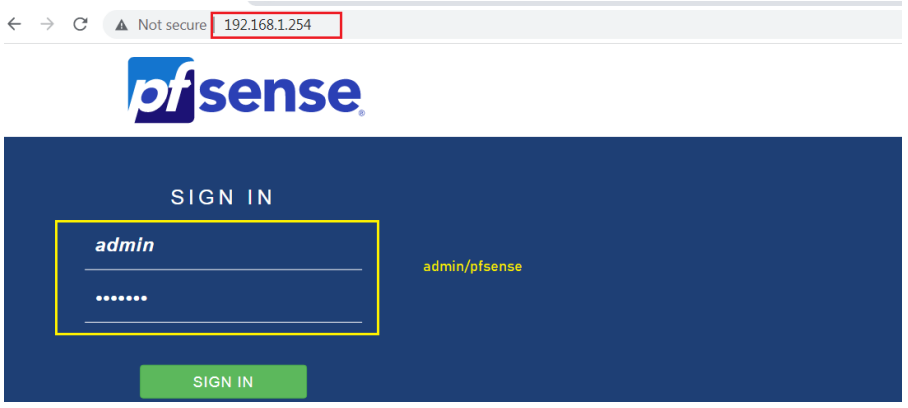 alt="A screenshot of a computer Description automatically generated" />

- Default credentials: Username: admin, Password: pfSense.

- Follow the setup wizard, configuring DNS servers (8.8.8.8, 4.4.4.4)
  and disabling "Block RFC1918 Private Networks" and "Block bogon
  Networks" on the WAN interface**.**

- Configure you WAN Interface' and scroll down to the bottom. We can
  scroll down to the bottom and untick Block RFC1918 Private Networks
  and Block bogon Networks options and click Next to continue the
  wizard.

- Set a new password or just click Next to continue.

- Then click Reload, to reload pfSense with new changes

- Just click Finish

- Click Accept to close the windows.

> 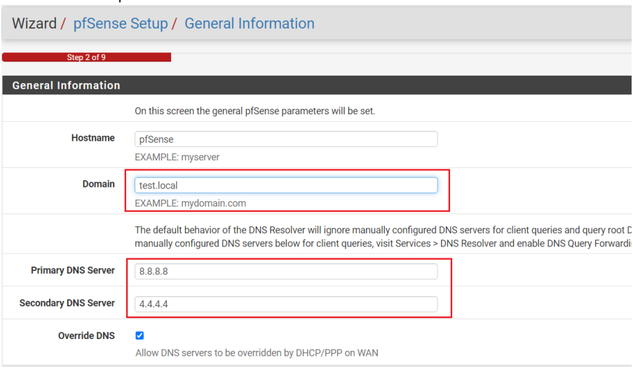 alt="A screenshot of a computer Description automatically generated" />
>
> 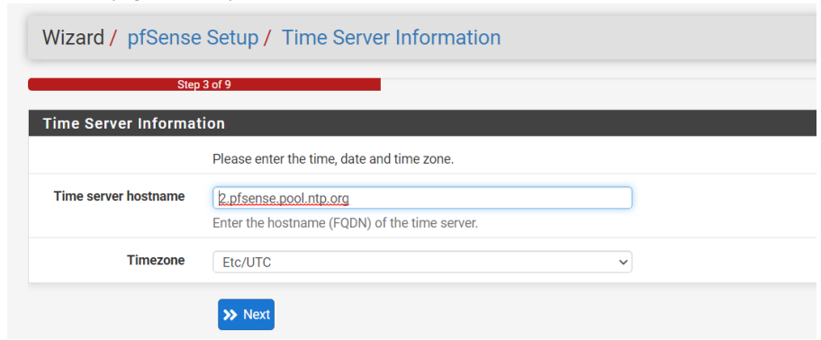 alt="A screenshot of a computer Description automatically generated" />
>
>  alt="A screenshot of a login page Description automatically generated" />
>
> 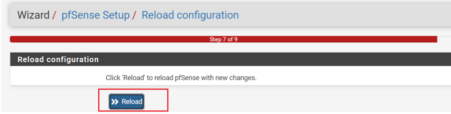 alt="A screenshot of a computer Description automatically generated" />
>
> 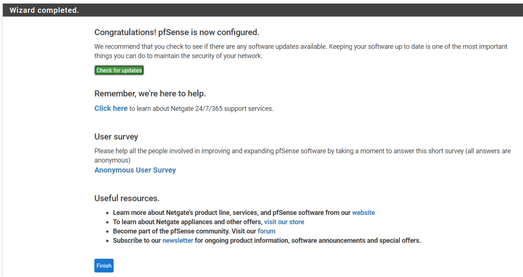 alt="A screenshot of a computer Description automatically generated" />
>
> 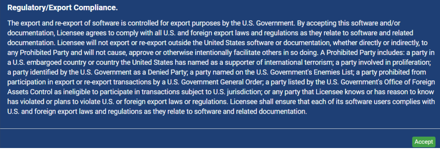 alt="A blue screen with white text Description automatically generated" />

2.  **Interface Configuration:**

    - OPT2 (em3): Name it "KALI," IP: 192.168.3.254. Save and apply.

> 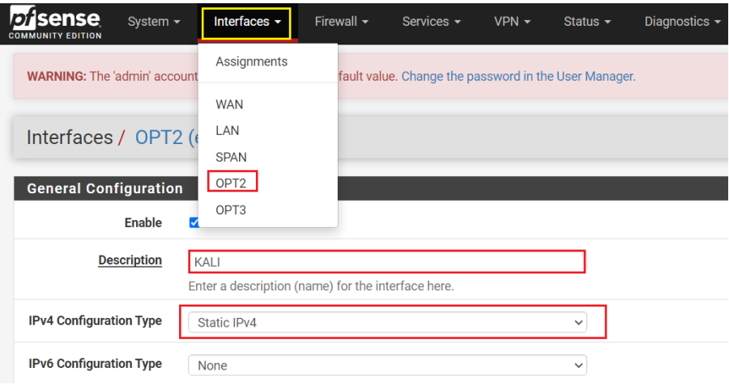 alt="A screenshot of a computer Description automatically generated" />

- OPT3 (em4): Name it "Wazuh," IP: 192.168.187.132. Save and apply.

> 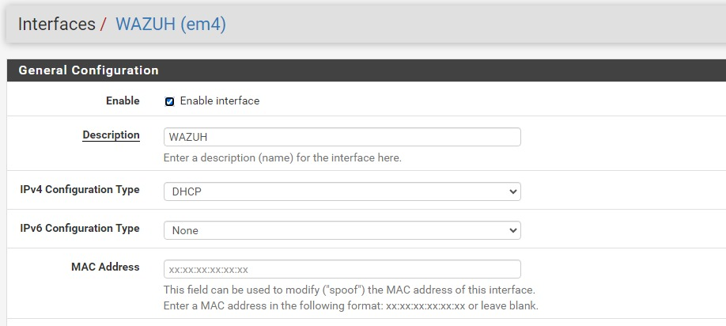 alt="A screenshot of a computer Description automatically generated" />

- OPT4 (em5): Name it "Splunk," set for VMnet6. Save and apply**.**

> 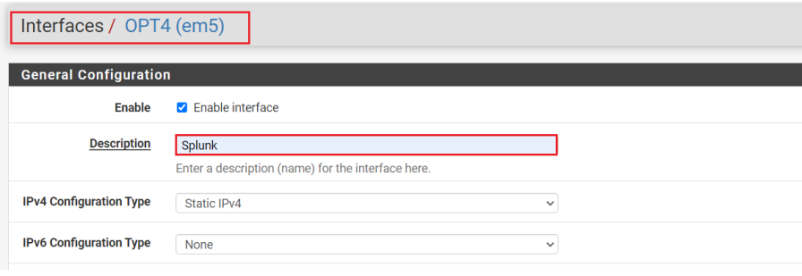 alt="A screenshot of a computer Description automatically generated" />

- Verify the Assignment by clicking on interfaces then navigating to
  interface assignments.

> 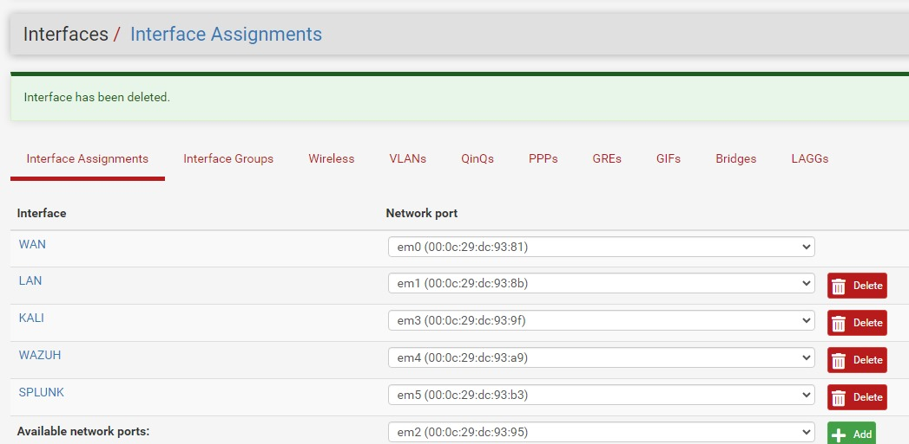 alt="A screenshot of a computer Description automatically generated" />

3.  **Firewall Rules:**

    - Under Firewall \> Rules, add rules to allow all traffic (Protocol:
      Any, Action: Pass) for WAN, LAN, KALI, WAZUH, and SPLUNK
      interfaces.

    - Apply changes.

> 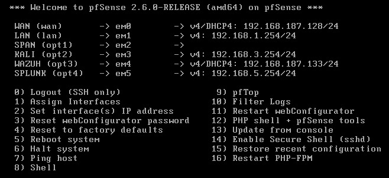 alt="A computer screen with white text Description automatically generated" />

# Kali Linux VM Setup

1.  **Download Kali Linux:**

    - Go to
      [Kali.org](https://www.kali.org/get-kali/#kali-virtual-machines)
      and download kali-linux-2023.2-vmware-amd64.7z.

> 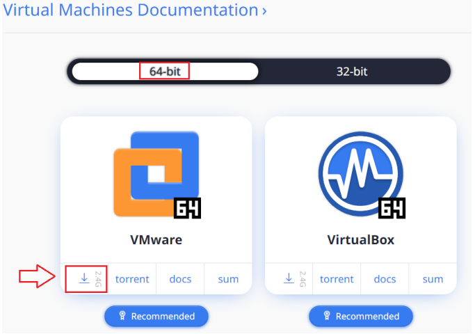 style="width:5.19241in;height:2.74246in" />

2.  **Unzip the File:**

    - Extract the .7z file to get the .vmdk file.

> 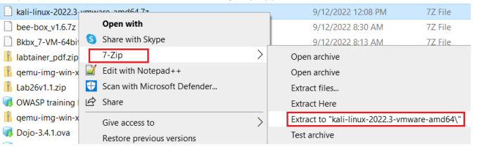 style="width:5.24646in;height:1.96233in" />

3.  **Open VMware Workstation Pro:**

    - Click on File \> Open.

> 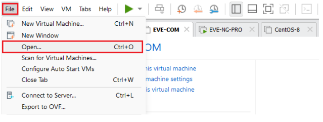 style="width:5.31268in;height:2.18458in" />

4.  **Load the VM:**

    - Navigate to the unzipped folder and select kali-linux-2023.vmx.

    - Click Open.

> 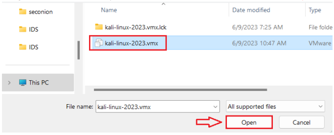 style="width:5.38125in;height:2.41584in" />

5.  **Change Network Adapter to VMnet4:**

    - In VMware Workstation Pro, go to VM \> Settings.

    - Select the Network Adapter.

    - Change the network connection to Custom: Specific virtual network
      and select VMnet4.

    - Click OK

6.  **Start the VM:**

    - Click on Power on this virtual machine to start Kali Linux OS.

> 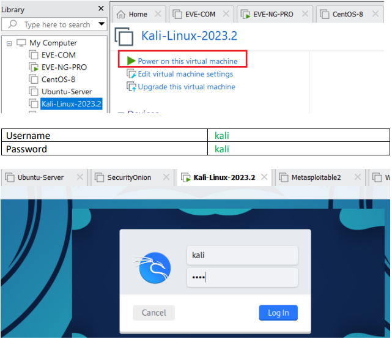 style="width:5.11145in;height:4.20197in" />

# Metasploitable 2 VM Setup

1.  **Download Metasploitable 2:**

    - Go to
      <https://sourceforge.net/projects/metasploitable/files/Metasploitable2/metasploitable-linux-2.0.0.zip/download>
      and download metasploitable-linux-2.0.0.zip.

> 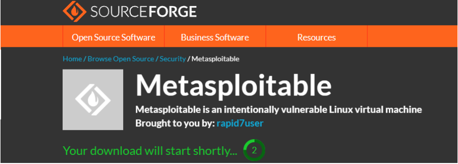 style="width:5.57959in;height:2.25806in" />

2.  **Unzip the File:**

    - Extract the .zip file using 7-Zip to get the .vmdk file.

> 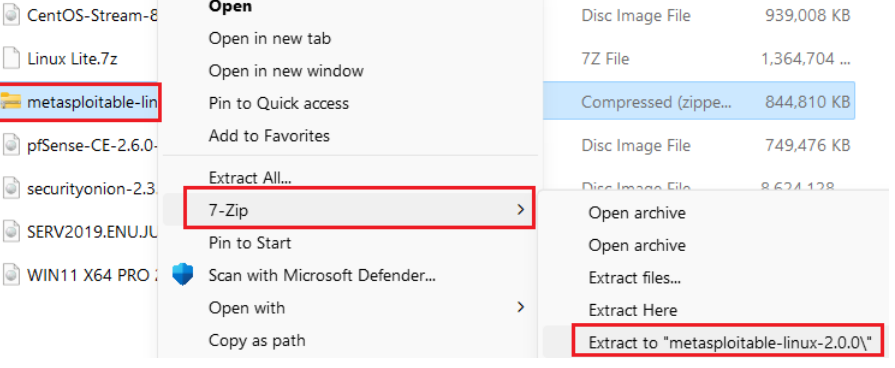 style="width:5.6088in;height:2.05409in" />

3.  **Open VMware Workstation Pro:**

    - Click on File \> Open.

> 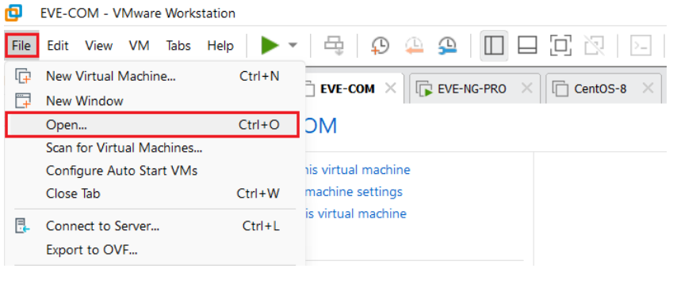 alt="A screenshot of a computer Description automatically generated" />

4.  **Load the VM:**

    - Navigate to the unzipped folder and select Metasploitable.vmx.

    - Click Open.

> 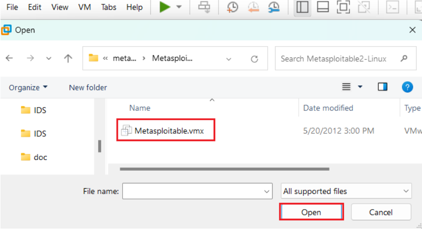 alt="A screenshot of a computer Description automatically generated" />

5.  **Change Network Adapter to VMnet2:**

    - In VMware Workstation Pro, go to VM \> Settings.

    - Select the Network Adapter.

    - Change the network connection to Custom: Specific virtual network
      and select VMnet2.

    - Click OK.

6.  **Start the VM:**

    - Click on Power on this virtual machine to start Metasploitable 2
      OS.

> 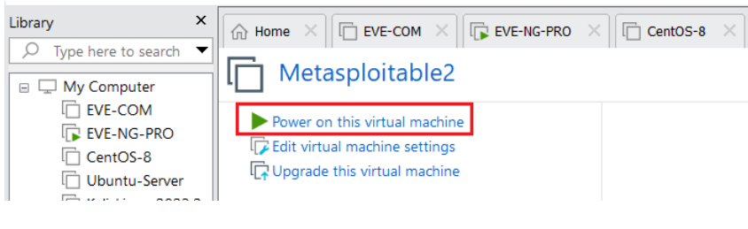 alt="A screenshot of a computer Description automatically generated" />

7.  **Login:**

    - Successfully login to the Metasploitable 2 CLI.

> 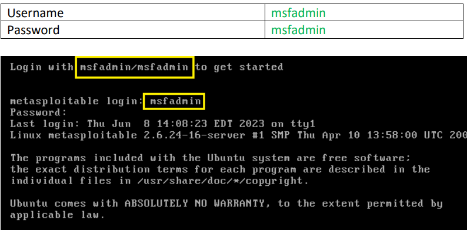 alt="A screenshot of a computer screen Description automatically generated" />

# Ubuntu-24.04 VM Setup

## Download and Install on VM

1.  **Download Ubuntu:**

    - Go to [Ubuntu Server Download](https://ubuntu.com/download/server)
      and download ubuntu-24.04-live-server-amd64.

> 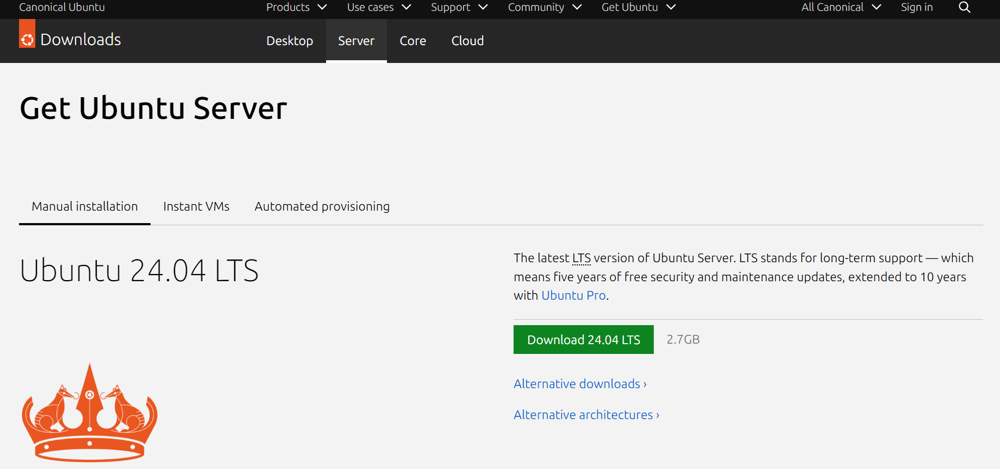

2.  **Open VMware Workstation Pro:**

    - Click on File \> New Virtual Machine.

    - Select Custom and click Next.

> 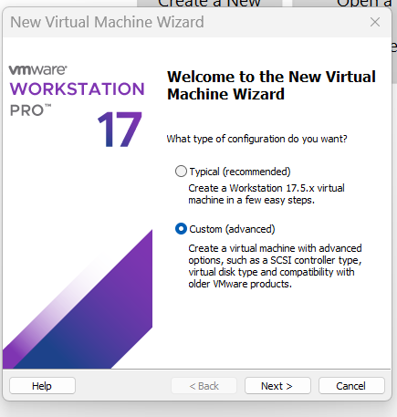 style="width:4.46992in;height:3.39865in" />

3.  **Hardware Compatibility:**

    - Choose the required hardware compatibility and click Next.

> 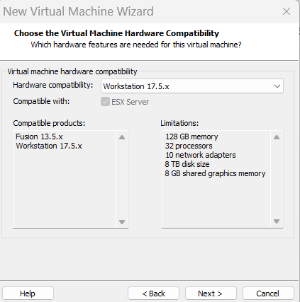 style="width:4.30626in;height:3.04338in" />

4.  **Guest OS Installation:**

    - Select Installer disc image file (iso) and browse to the
      downloaded ISO file.

    - Click Next.

> 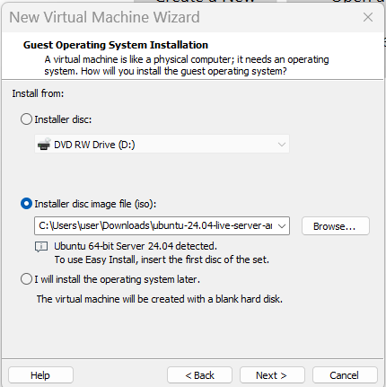 style="width:4.34516in;height:3.07345in" />

5.  **VM Name and Location:**

    - Provide a name and choose the location for the virtual machine.
      Click Next.

> 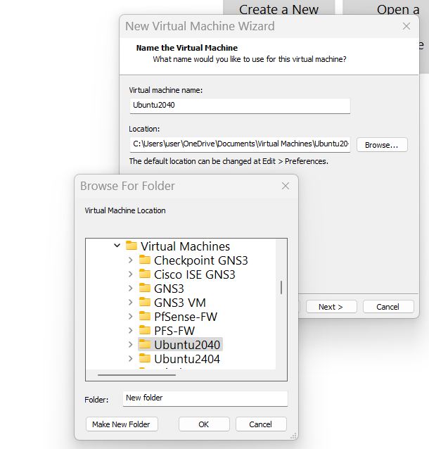 style="width:4.47641in;height:3.54902in" />

6.  **Processor Configuration:**

    - Adjust the number of processors and cores per processor as needed.
      Click Next.

> 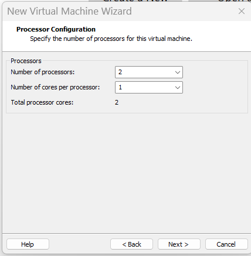 style="width:4.39709in;height:3.31759in" />

7.  **Memory Allocation:**

    - Set the memory allocation (e.g., 4GB). Click Next.

> 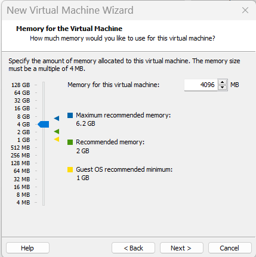 style="width:4.41157in;height:3.0389in" />

8.  **Networking:**

    - Select Use bridged networking for initial setup. Click Next.

    - Change to VMnet6 after setup.

> 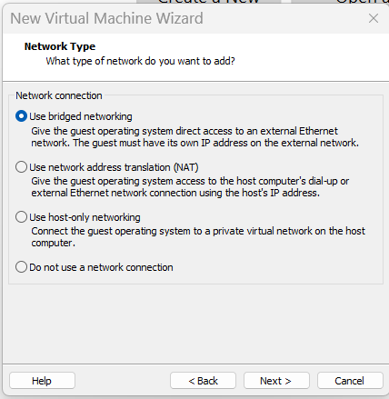 alt="A screenshot of a computer Description automatically generated" />

9.  **Controller Types:**

    - Keep LSI Logic (Recommended) and click Next.

>  style="width:4.47213in;height:2.46932in" />

- Keep SCSI (Recommended) and click Next.

> 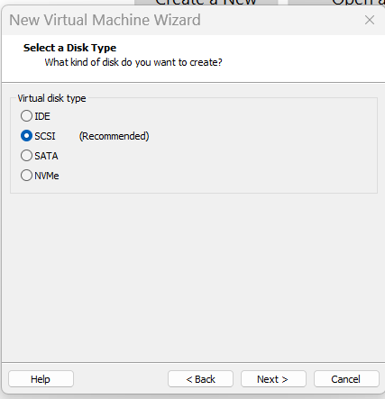 style="width:4.41412in;height:2.31703in" />

10. **Disk Setup:**

    - Select Create a New Virtual Disk and click Next.

> 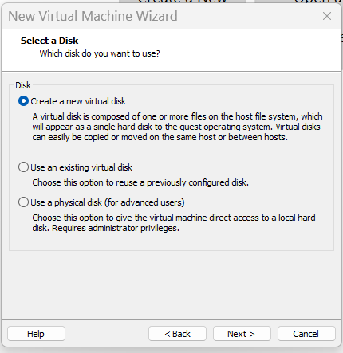 alt="A screenshot of a computer Description automatically generated" />

11. **Virtual Machine Wizard**

- Increase the disk size to 40GB

- Spilt the virtual disk into multiple files

> 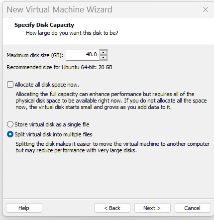 style="width:4.3989in;height:2.88366in" />

12. **Summary and Customization:**

    - Review the settings.

    - Click Customize Hardware if needed:

      - Increase memory to 4GB.

      - Delete USB controller.

      - Change CD/DVD connection to Use ISO Image file.

> 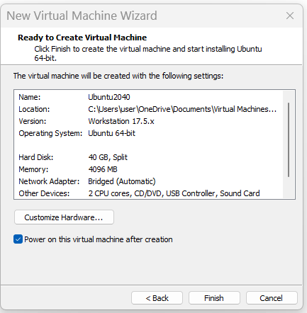 style="width:4.46205in;height:3.18227in" />
>
> 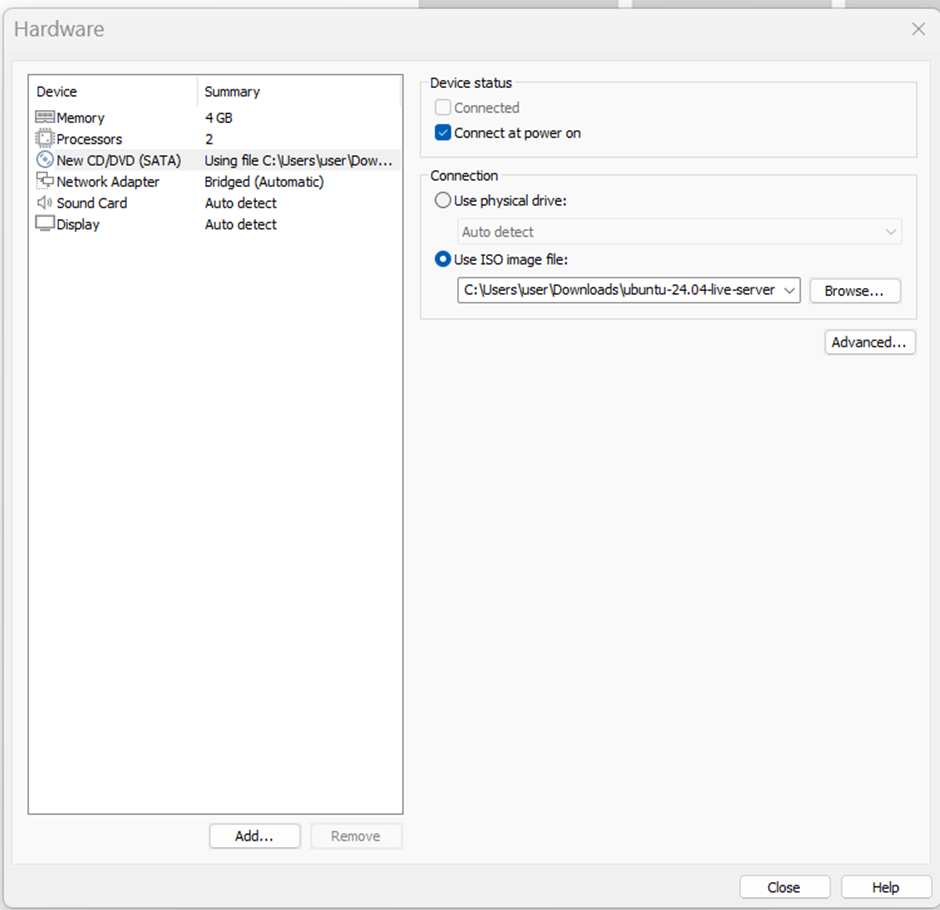 style="width:4.46822in;height:3.18264in" />

13. **Finish Setup:**

    - Click Finish.

14. **Power On:**

    - Click Power on this virtual machine to start the Ubuntu OS.

##  Configuring the Ubuntu Server

1.  **Start Installation:**

    - Click on Try or Install Ubuntu Server.

> 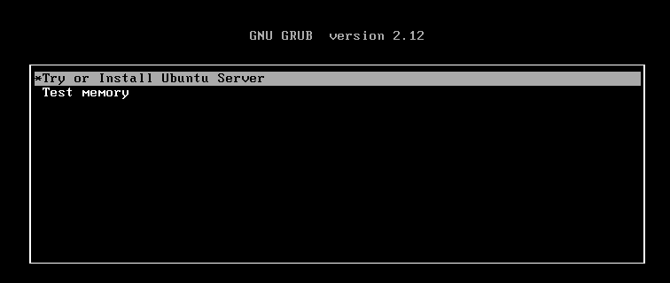 style="width:4.57683in;height:1.80085in" />

2.  **Language Selection:**

    - Choose your language and click Done.

> 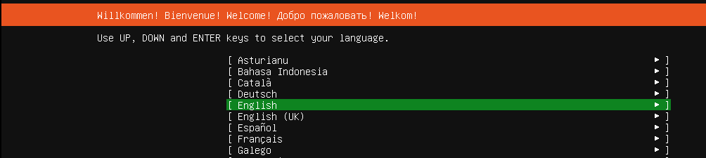 style="width:4.71266in;height:1.05573in" />

3.  **Keyboard Layout:**

    - Choose your keyboard layout and click Done.

> 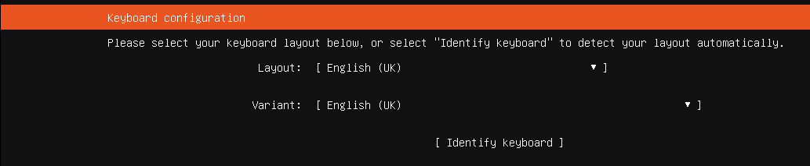 style="width:4.94278in;height:1.26115in" />

4.  **Type of Installation:**

    - Select Ubuntu Server using the space bar and click Done.

> 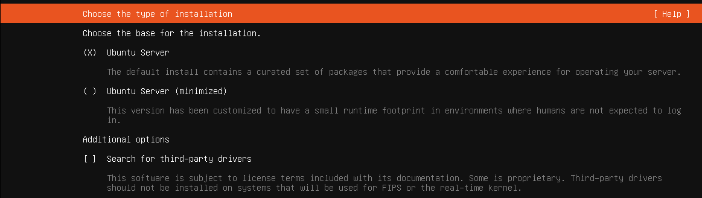 style="width:4.87738in;height:1.64116in" />

5.  **Network Configuration:**

    - Click Continue for network connection.

> 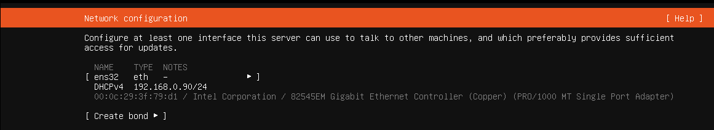 style="width:5.04101in;height:1.37322in" />

6.  **Ubuntu Archive Mirror:**

    - Click Done to use the default address.

> 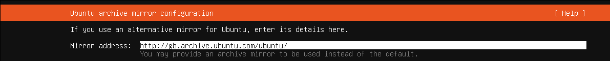 style="width:5.1264in;height:1.15706in" />

7.  **Storage Configuration:**

    - Select Use entire disk and click Done.

> 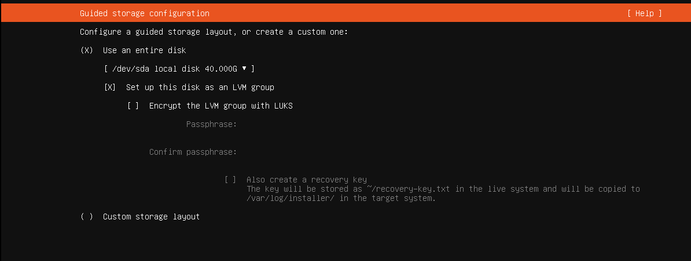 style="width:5.02594in;height:1.90213in" />

- Confirm destructive action by clicking Continue.

> 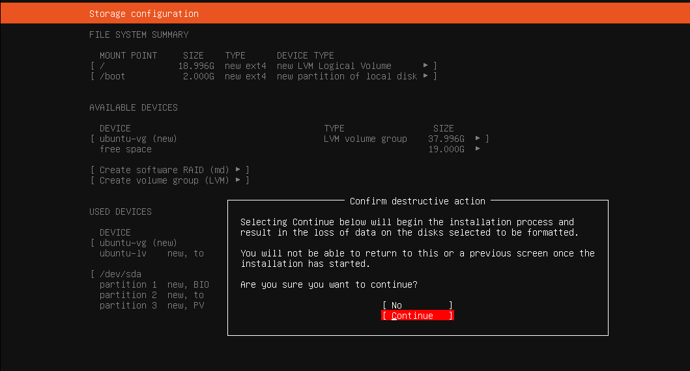 style="width:5.04537in;height:2.71553in" />

8.  **Profile Setup:**

    - Input your profile information and keep it in a safe place.

> 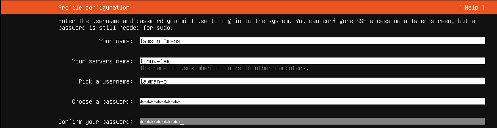 alt="A black and white striped background Description automatically generated" />

9.  **OpenSSH Server:**

    - Select Install OpenSSH server and click Done.

> 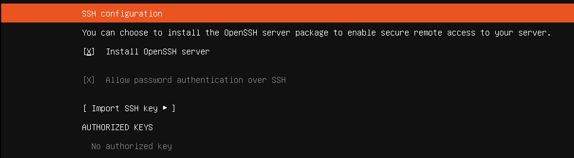 style="width:5.26863in;height:1.45287in" />

10. **Feature Server Snaps:**

    - Do not select any snaps and click Done.

> 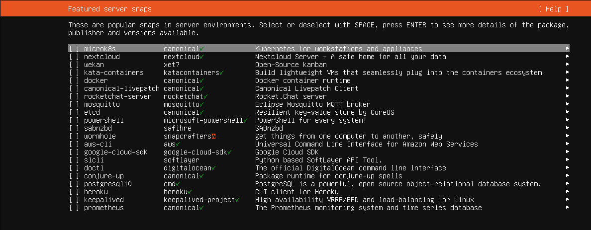 alt="A screenshot of a computer Description automatically generated" />

11. **Installation Process:**

    - Wait for the installation to complete.

12. **Reboot Server:**

    - Click on Reboot.

13. **Log In:**

    - Log in with the username and password you created.

14. **Update Server:**

    - Run: sudo apt update && sudo apt upgrade.

15. **Install GUI:**

    - Run: sudo apt install ubuntu-desktop.

16. **Reboot Server:**

    - Run: sudo reboot.

17. **Change Network Adapter to VMnet6:**

    - Shut down the VM.

    - In VMware Workstation Pro, go to VM \> Settings.

    - Select the Network Adapter.

    - Change the network connection to Custom: Specific virtual network
      and select VMnet6.

    - Click OK.

    - Power on the VM again.

18. **Install Net Tools:**

    - Run: sudo apt install net-tools.

# Windows Server 2019 Installation

## Download and install on VM

1.  **Download ISO**: Get the Windows Server 2019 .ISO from
    [here](https://www.microsoft.com/en-us/evalcenter/download-windows-server-2019).

2.  **Create VM**:

    - Open VMware, click **Create a New Virtual Machine**.

> 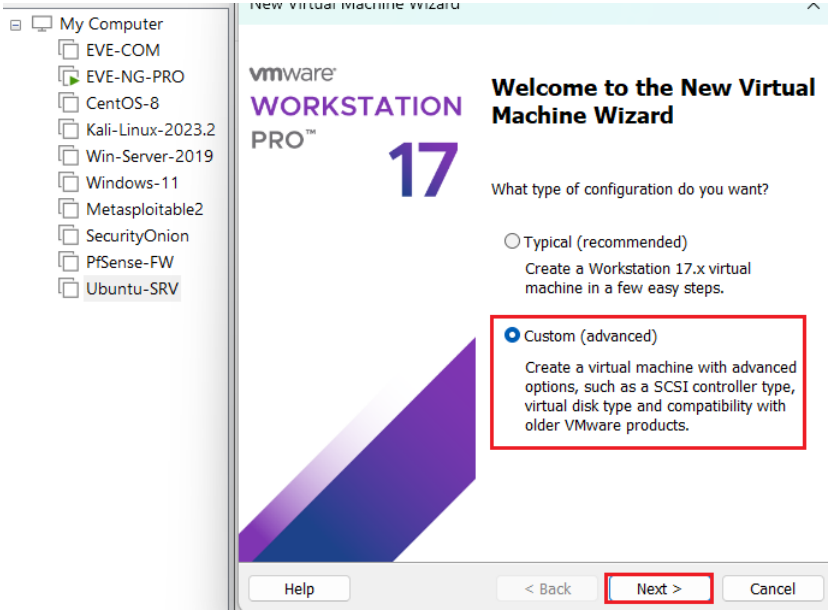 alt="A screenshot of a computer Description automatically generated" />

- Select **Custom (advanced)**, click **Next**.

- Choose compatible hardware, click **Next**.

> 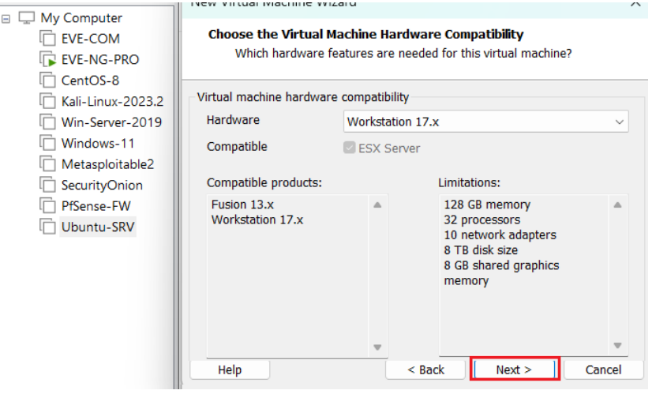 alt="A screenshot of a computer Description automatically generated" />

- Select **Install operating system later**, click **Next**.

> 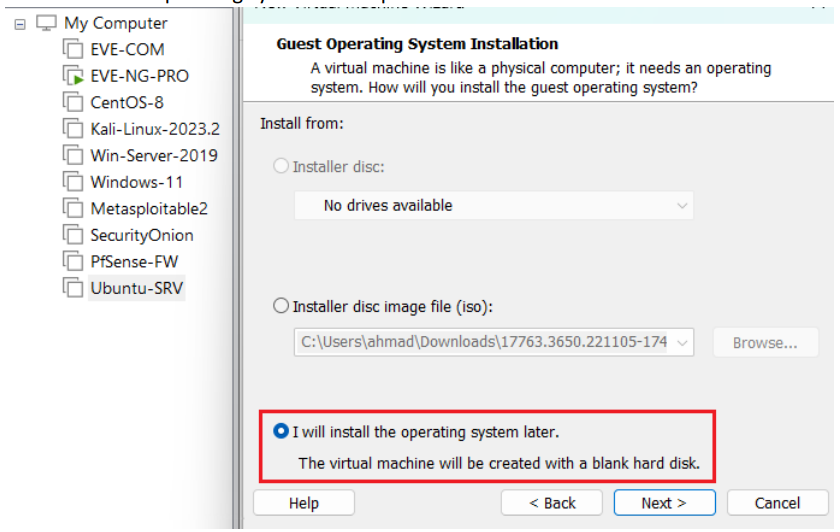 alt="A screenshot of a computer Description automatically generated" />

- Choose **Guest OS** and click **Next**.

> 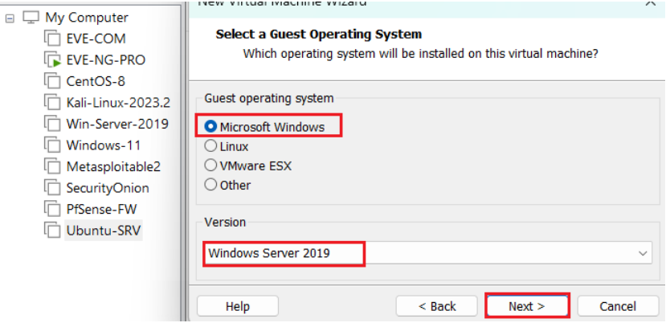 alt="A screenshot of a computer Description automatically generated" />

- Name the VM and choose location, click **Next**.

> 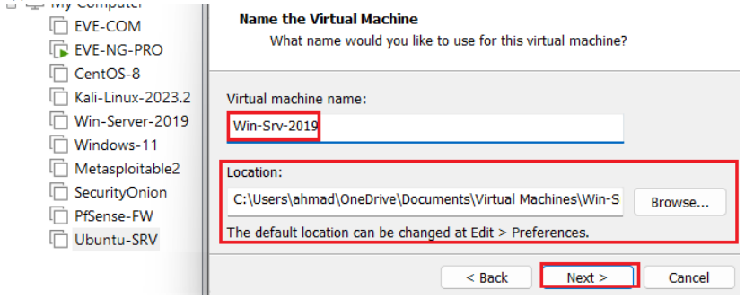 style="width:5.75476in;height:2.30866in" />

- Select **BIOS** or **UEFI**, click **Next**.

> 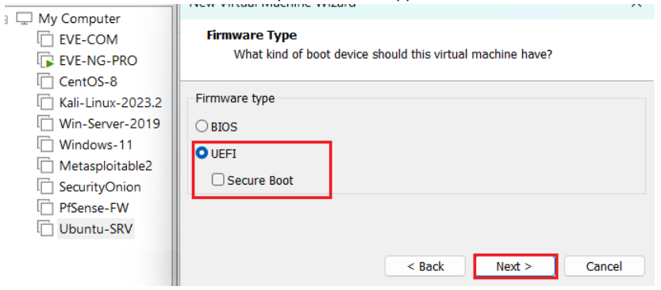 alt="A screenshot of a computer Description automatically generated" />

3.  **Configure VM**:

    - Allocate processors, click **Next**.

> 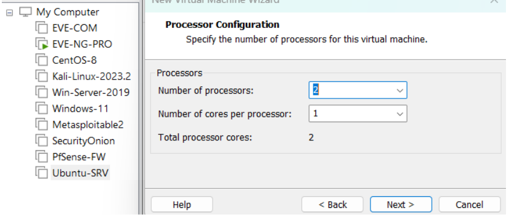 alt="A screenshot of a computer Description automatically generated" />

- Set memory, click **Next**.

>  alt="A screenshot of a computer Description automatically generated" />

- Configure network, click **Next**.

> 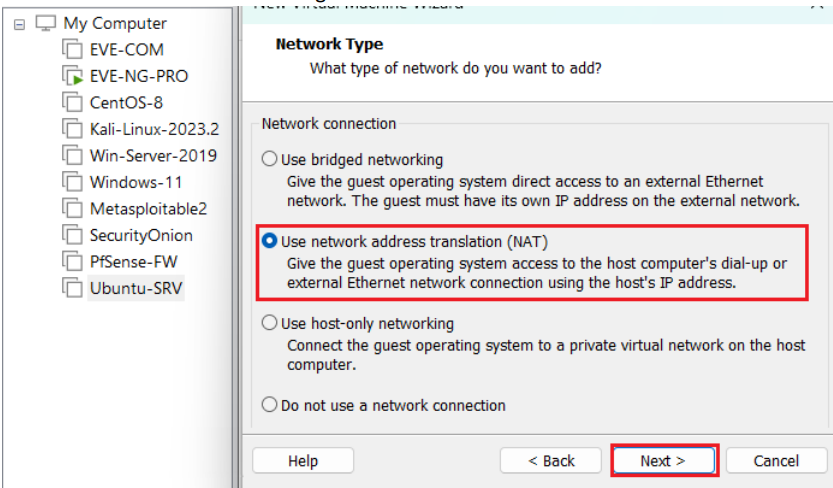 alt="A screenshot of a computer Description automatically generated" />

- Select storage controller, click **Next**.

> 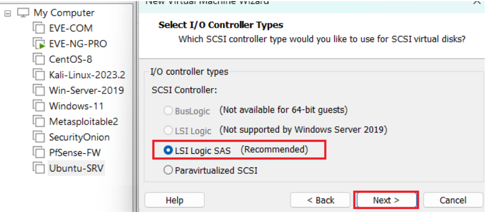 alt="A screenshot of a computer Description automatically generated" />

- Choose disk type, click **Next**.

> 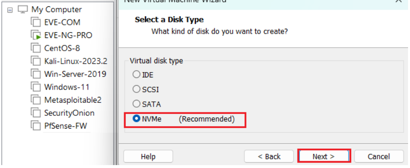 alt="A screenshot of a computer Description automatically generated" />

- Create/select virtual disk, click **Next**.

> 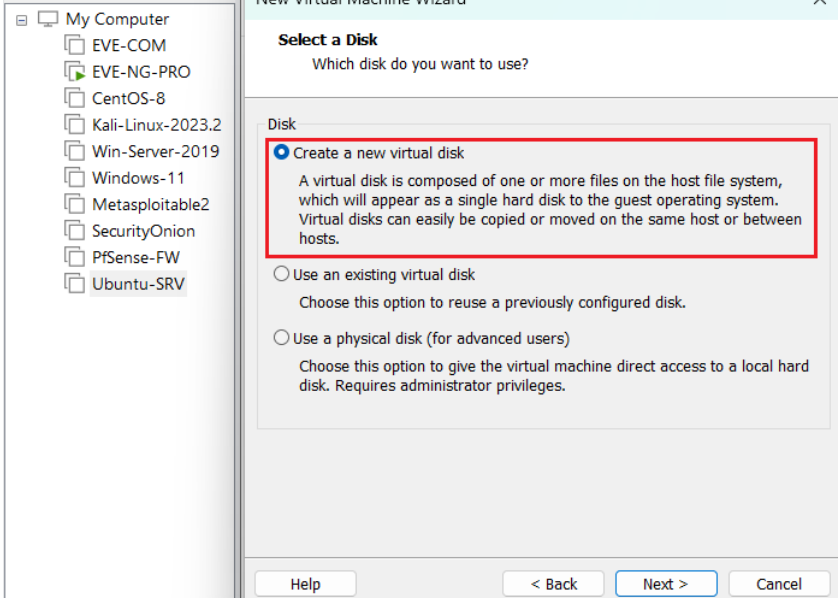 alt="A screenshot of a computer Description automatically generated" />

- Specify disk capacity (e.g., 100 GB), click **Next**.

> 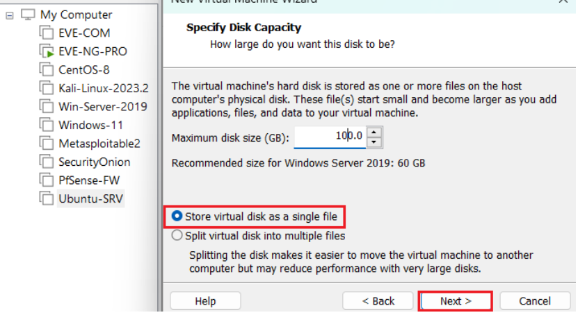 alt="A screenshot of a computer Description automatically generated" />

- Set disk location, click **Next**.

> 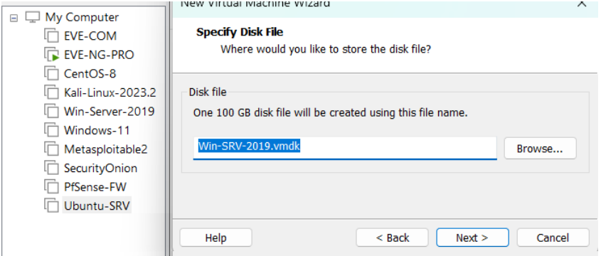 alt="A screenshot of a computer Description automatically generated" />

4.  **Customize Hardware**:

    - Click **Customize Hardware**.

> 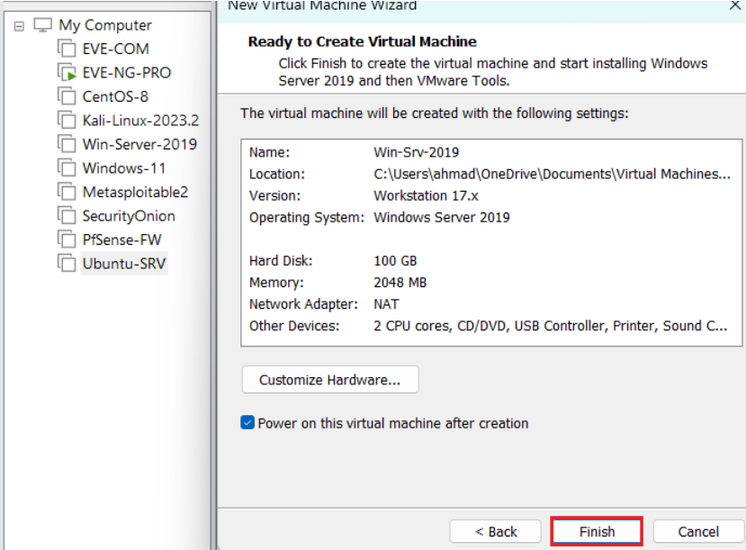 alt="A screenshot of a computer Description automatically generated" />

- Select **New CD/DVD (SATA)**, use ISO image, click **Browse**, select
  ISO, click **OK**.

> 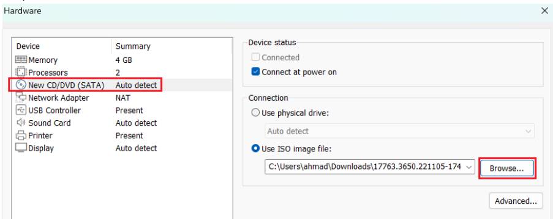 alt="A screenshot of a computer Description automatically generated" />

5.  **Boot VM**:

    - Power on the VM.

> 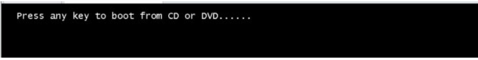 alt="A black and white text on a black background Description automatically generated" />

- Press **spacebar** to boot from the virtual DVD ROM. Restart if
  missed.

6.  **Install OS**:

    - Choose language, time, and keyboard settings, click **Next**.

> 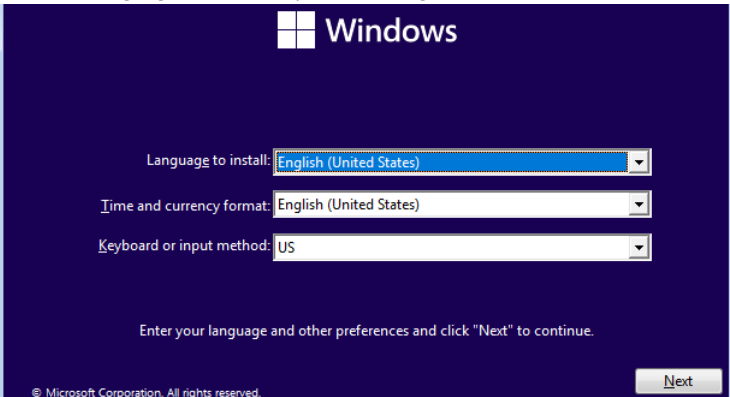 alt="A screenshot of a computer Description automatically generated" />

- Click **Install Now**.

> 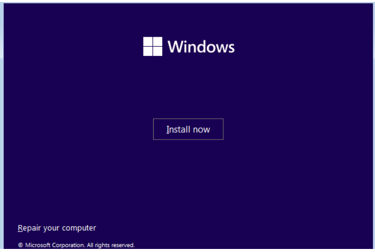 alt="A screenshot of a computer Description automatically generated" />

- Select **Windows Server 2019 Standard Evaluation (Desktop
  Experience)**, click **Next**.

> 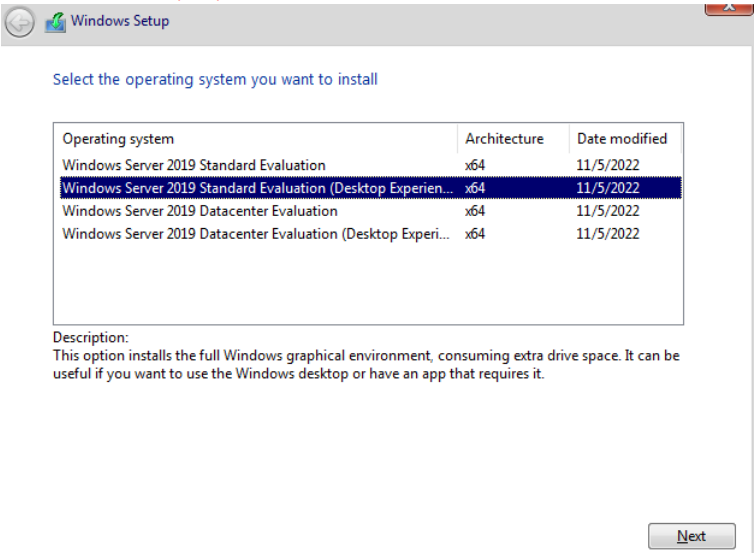 alt="A screenshot of a computer Description automatically generated" />

- Accept License Agreement, click **Next**.

> 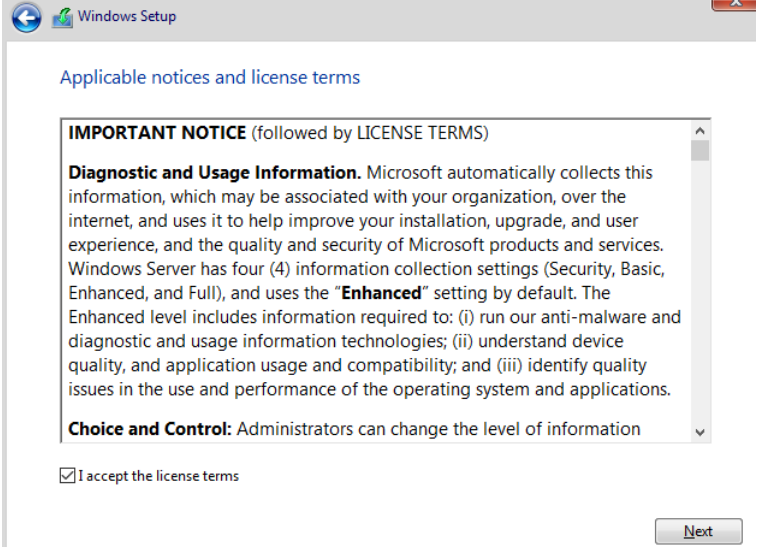 alt="A screenshot of a computer Description automatically generated" />

- Select **Custom Installation**.

> 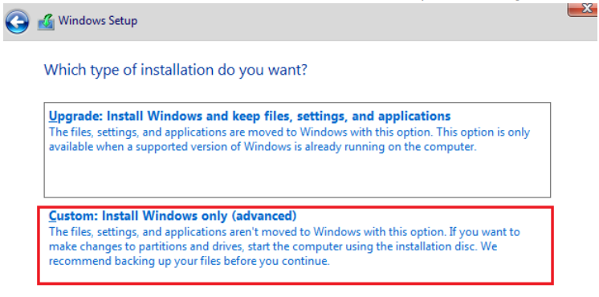 alt="A screenshot of a computer Description automatically generated" />

- Choose installation disk, click **Next**

> 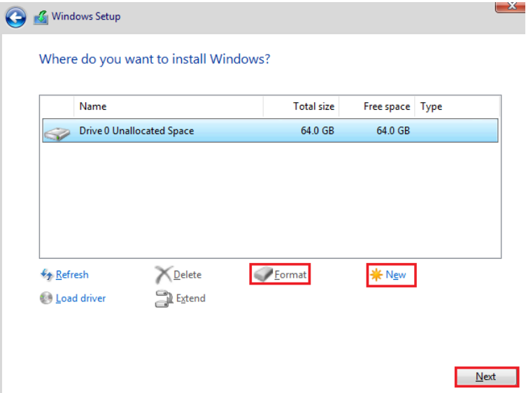 style="width:5.51175in;height:2.70285in" />

7.  **Setup Admin**:

    - Create Administrator user, set password, click **Finish**.

> 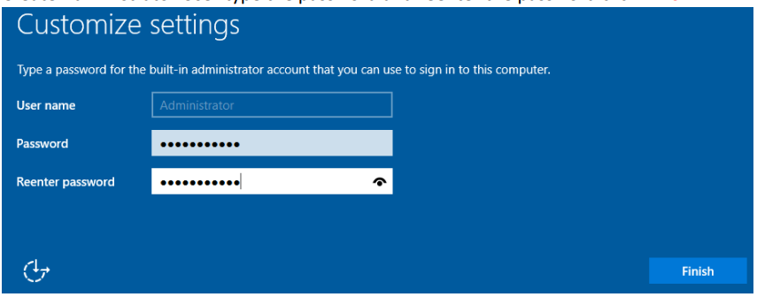 alt="A screenshot of a computer login Description automatically generated" />

- Login screen appears.

> 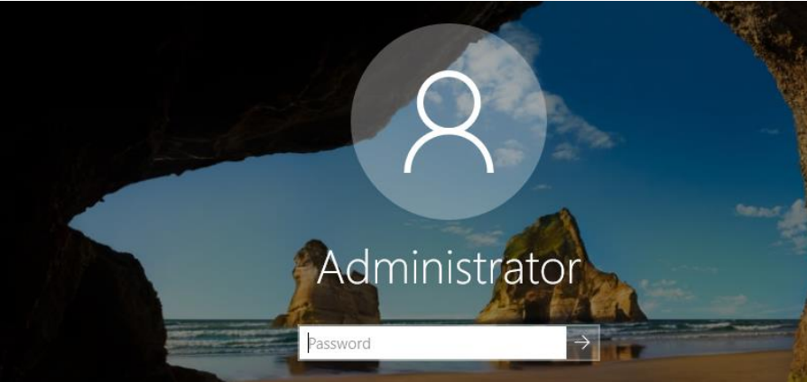 alt="A login screen with a person&#39;s hand under a rock Description automatically generated" />

## Active Directory (AD) Setup

### Setting up Active Directory on Window 2019

1.  **Open Server Manager**: Click **Add Roles and Features**.

> 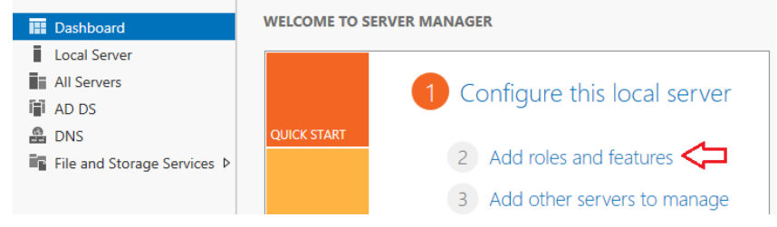 style="width:6.26806in;height:1.83333in" />

2.  **Installation Type**:

    - Click **Next** on the "Before you begin" window.

> 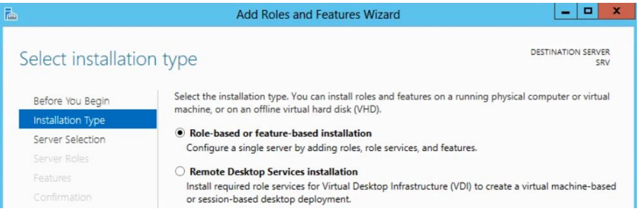 alt="A screenshot of a computer Description automatically generated" />

- Select **Role-based or feature-based installation**, click **Next**.

3.  **Select Server**:

    - Choose **Select a server from the server pool**.

> 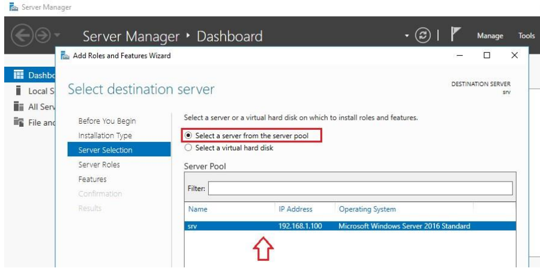 alt="A screenshot of a computer Description automatically generated" />

- Select the server’s name, click **Next**.

4.  **Add AD DS**:

    - Select **Active Directory Domain Services**.

> 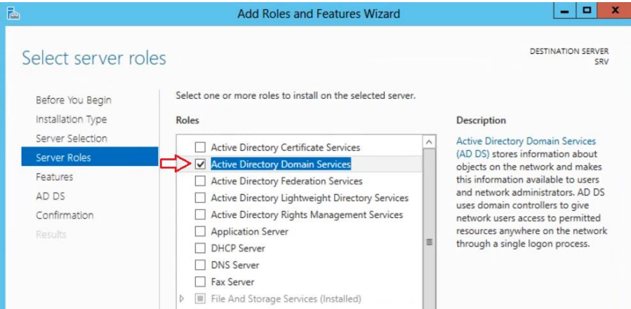 style="width:5.66808in;height:2.48737in" />

- In the dialog box, click **Add Features**, then **Next**.

> 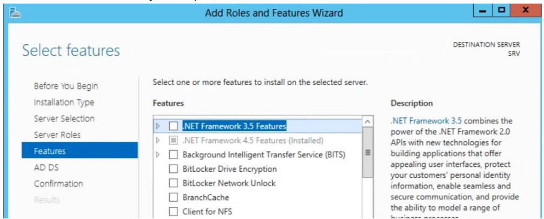 style="width:5.65933in;height:2.26164in" />

5.  **Default Features**:

    - On the Features page, keep defaults, click **Next**.

> 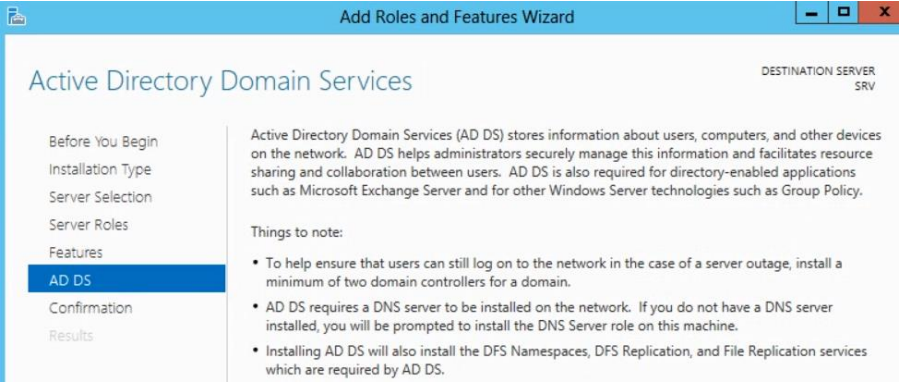 alt="A screenshot of a computer Description automatically generated" />

6.  **Review Information**:

    - On the AD DS page, review info, click **Next**.

> 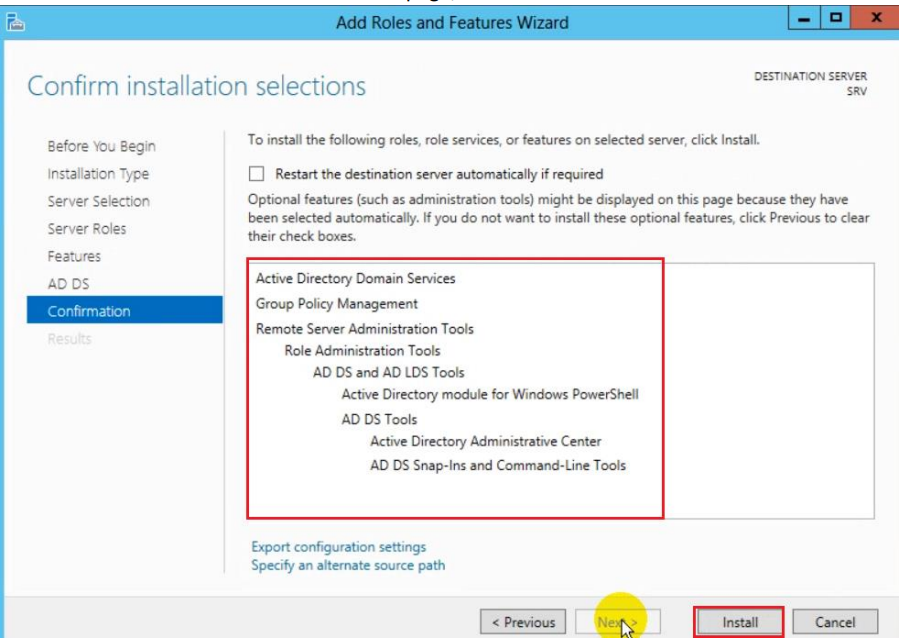 alt="A screenshot of a computer Description automatically generated" />

7.  **Install**:

    - On the Confirmation page, click **Install**.

    - Server will restart after installation.

> 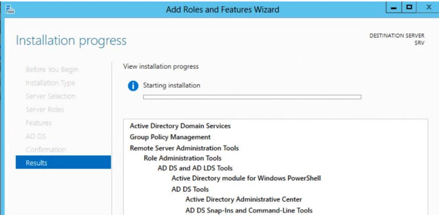 alt="A screenshot of a computer Description automatically generated" />

8.  **Post-Installation**:

    - In Server Manager, click **AD DS** in the navigation tree.

> 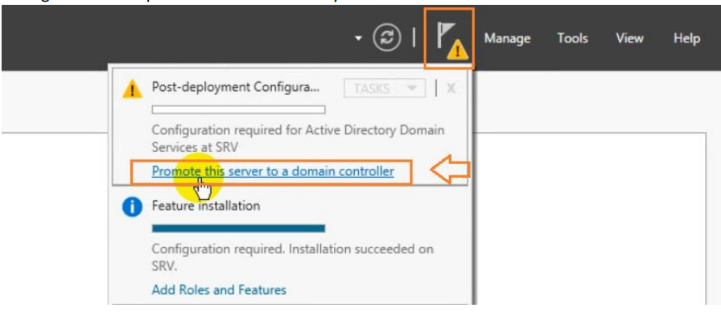 style="width:5.65483in;height:2.33533in" />

- Click **More** in the right pane for AD DS configuration.

9.  **Deploy Configuration**:

    - Select **Add a new forest** (first domain controller).

> 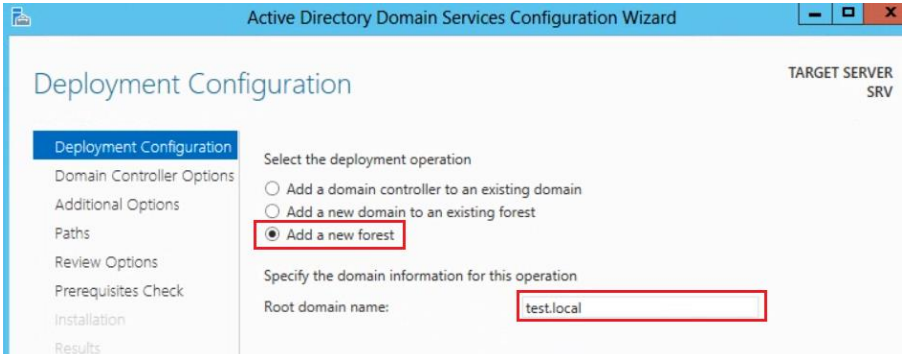 style="width:5.65565in;height:2.04928in" />

- Enter Root domain name, click **Next**.

10. **Domain Controller Options**:

    - Select Forest and Domain functional levels (default: Windows
      Server 2012).

    - Enter DSRM Password, click **Next**.

> 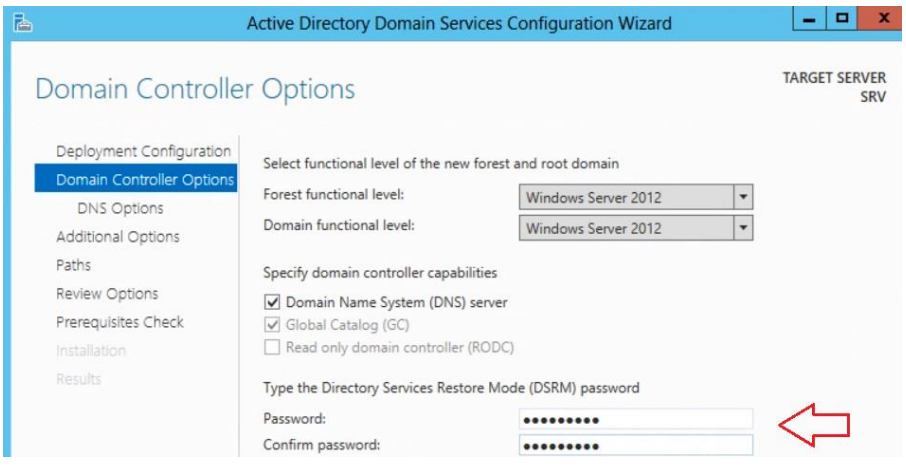 alt="A screenshot of a computer Description automatically generated" />

11. **DNS Options**: Click **Next**.

> 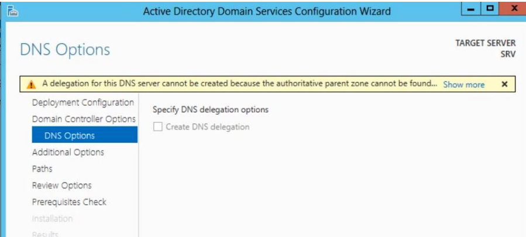 style="width:6.05741in;height:2.76002in" />

12. **NetBIOS Name**: Automatically inputted, click **Next**.

> 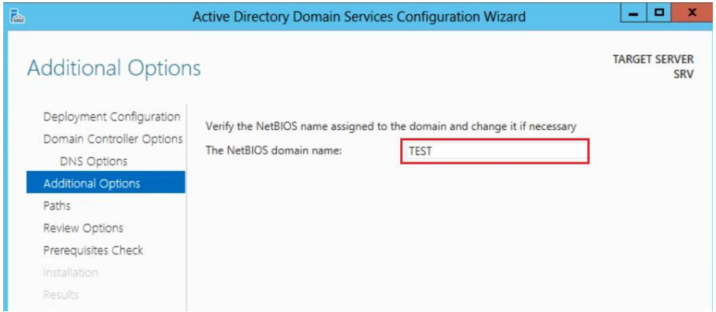 style="width:5.79974in;height:2.00382in" />

13. **Paths**: Verify/change locations for Database, Log files, and
    SYSVOL folders, click **Next**.

>  style="width:5.83925in;height:1.89066in" />

14. **Review Options**: Click **Next**.

> 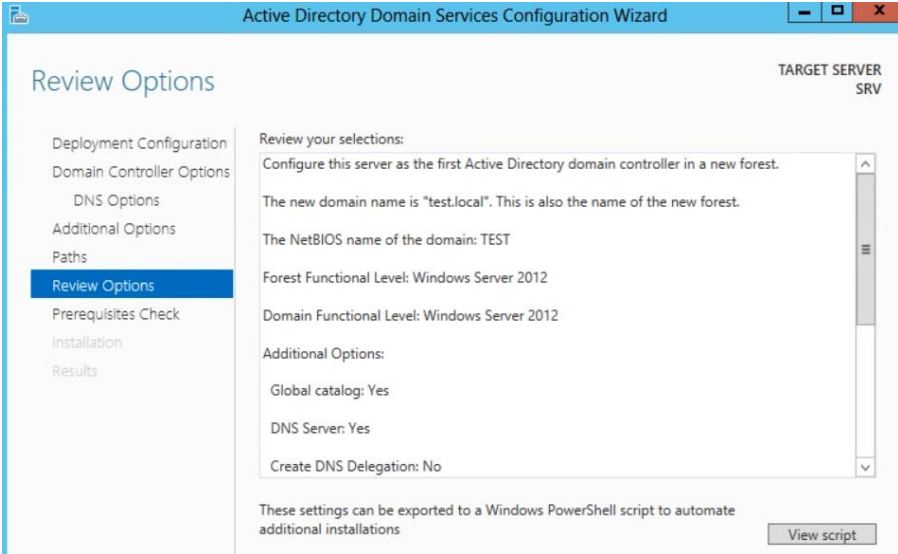 alt="A screenshot of a computer Description automatically generated" />

15. **Prerequisite Check**:

    - After check completes successfully, click **Install**.

    - Server will restart after configuration, completing the setup as a
      domain controller.

> 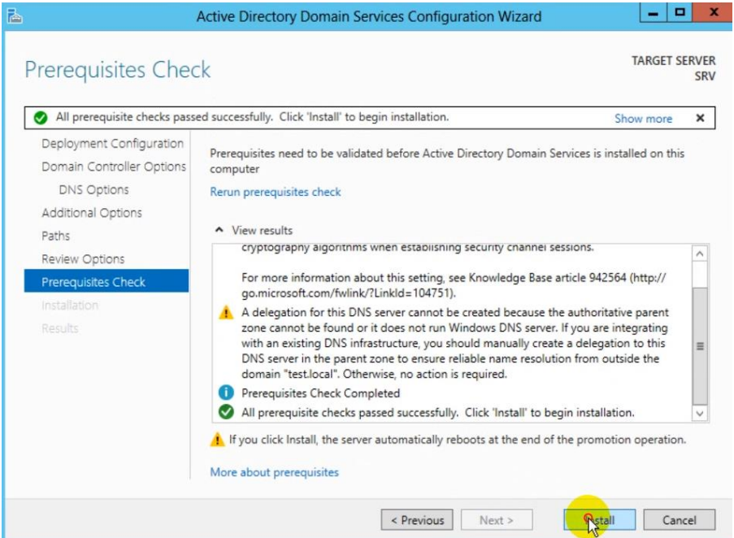 style="width:5.67325in;height:2.53343in" />

### Create Users and Groups

1.  **Open Active Directory Users and Computers**:

    - Go to **Server Manager** \> **Tools** \> **Active Directory Users
      and Computers**.

2.  **Create Organizational Unit (OU)**:

    - Right-click your domain name.

    - Select **New** \> **Organizational Unit**.

    - Enter the name for the new OU, click **OK**.

> 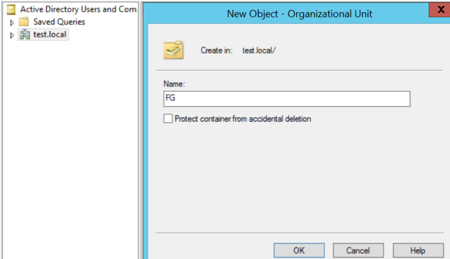 alt="A screenshot of a computer Description automatically generated" />

3.  **Create a New Group**:

    - Navigate to the newly created OU.

    - Right-click the OU, select **New** \> **Group**.

    - Enter the group name, select group type (security/distribution),
      click **OK**.

> 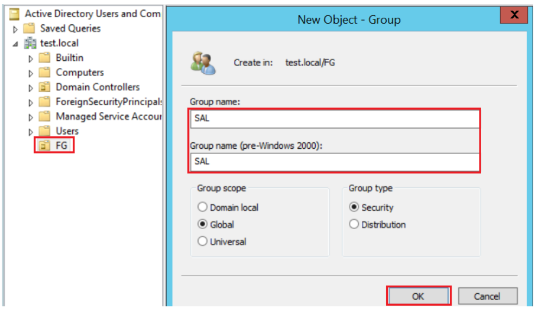 alt="A screenshot of a computer Description automatically generated" />

4.  **Create a New User**:

    - Right-click the OU, select **New** \> **User**.

    - Enter the user's details (first name, last name, user logon name),
      click **Next**.

    - Set the user's password, confirm it, and configure password
      options, click **Next**.

    - Click **Finish** to create the user.

### Configuring DNS

1.  **Open Server Manager**:

    - Navigate to **Tools** \> **DNS**.

> 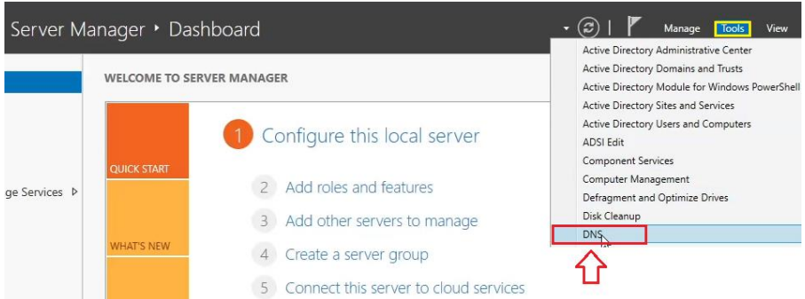 alt="A screenshot of a computer Description automatically generated" />

2.  **Create a New Zone**:

    - In DNS Manager, right-click on **Reverse Lookup Zones**.

> 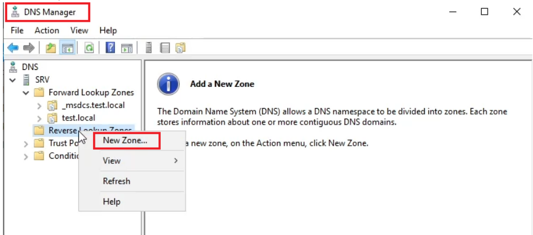 alt="A screenshot of a computer Description automatically generated" />

- Select **New Zone** to open the New Zone Wizard.

- Select **Primary Zone**, click **Next**.

> 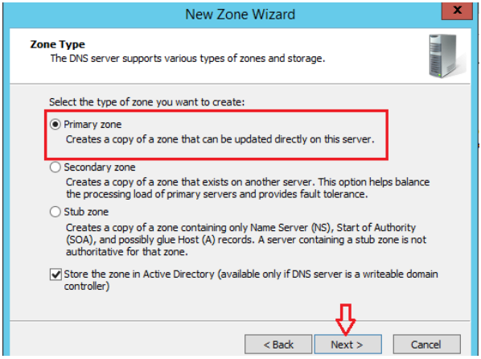 alt="A screenshot of a computer Description automatically generated" />

- Choose **IPv4 Reverse Lookup Zone**, click **Next**.

> 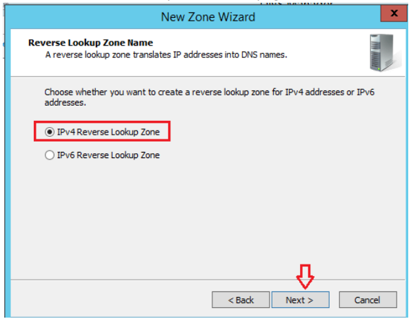 alt="A screenshot of a computer Description automatically generated" />

- Enter the network ID (first three octets of the IP address), click
  **Next**.

> 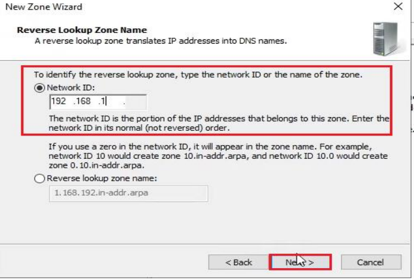 alt="A screenshot of a computer Description automatically generated" />

- Choose **Allow only secure dynamic updates**, click **Next**.

> 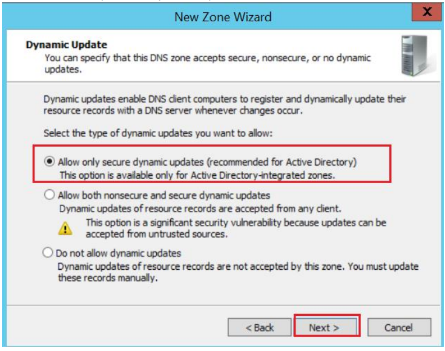 style="width:5.63561in;height:2.80315in" />

- Verify settings, click **Finish**.

> 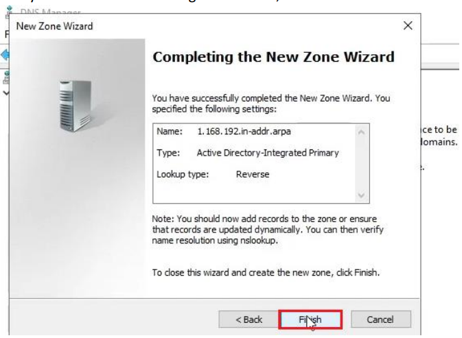 style="width:5.7953in;height:2.79396in" />

3.  **Verify DNS Configuration**:

    - Open **cmd** or **PowerShell**.

    - Run nslookup.

    - Verify that the default DNS server is srv.test.local with address
      192.168.1.100.

> 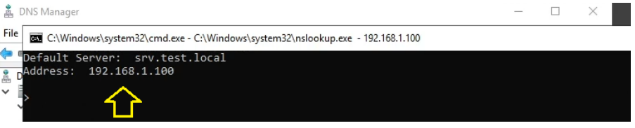 alt="A black and white screen Description automatically generated with medium confidence" />

4.  **Add Host Record**:

    - Right-click the zone name, select **New Host (A or AAAA)**.

    - In the popup window:

      - Enter the host machine name in the **Name** field.

      - The **Fully Qualified Domain Name (FQDN)** field updates
        automatically.

      - Enter the full IP address of the host machine in the **IP
        address** field.

      - Check **Create associated pointer (PTR) record**.

    - Click **OK** to create the host record.

# Install Splunk 9 on Linux Ubuntu

## Download and install Splunk on Linux Ubuntu

1.  Download Splunk:

- Go to Splunk Enterprise Download.
  <https://www.splunk.com/en_us/download/splunk-enterprise.html>

> 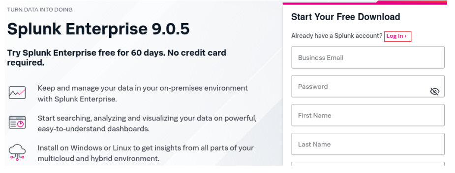 style="width:5.79408in;height:1.90302in" />

- Log in or create a Splunk account.

> 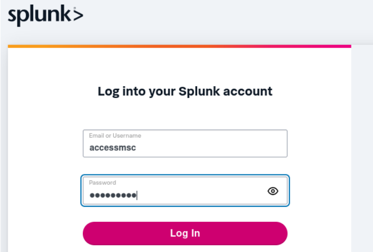 alt="A screenshot of a login box Description automatically generated" />

- Navigate to Products \> Splunk Enterprise or Free Trials & Downloads.

> 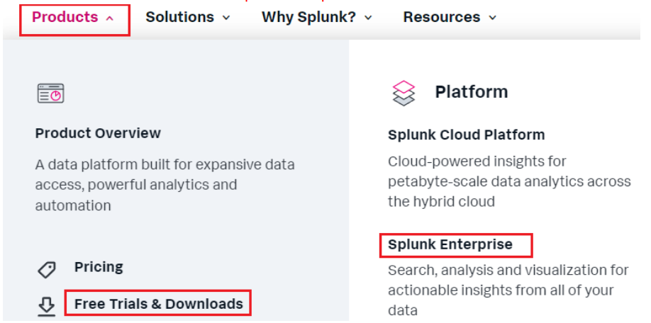 style="width:5.55686in;height:1.75095in" />

- Click on Free Splunk, then Free Trials and Downloads.

- Select Linux, download the .tgz file.

> 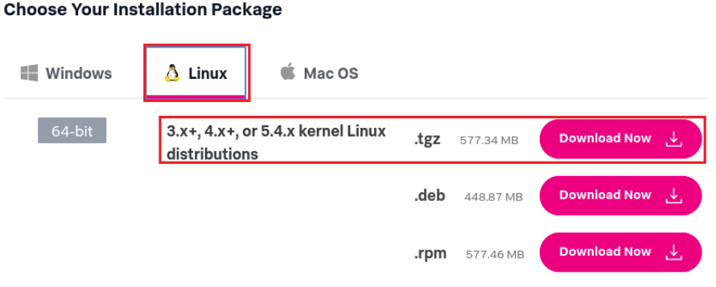 style="width:5.64666in;height:1.92285in" />

2.  Move and Decompress File:

- Move the downloaded file to the /home/user/Downloads directory.

>  alt="A screenshot of a computer Description automatically generated" />

- Decompress the tar file using tar -xvzf (name of splunk file)

> 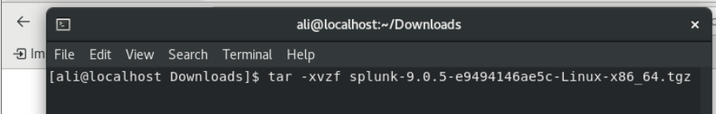 alt="A screenshot of a computer Description automatically generated" />

3.  Start Splunk:

- Navigate to the Splunk directory using : cd splunk/bin

- Start Splunk with: ./splunk start.

> 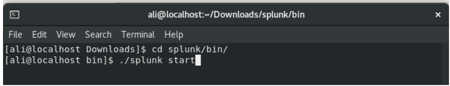 style="width:5.80375in;height:0.84323in" />

- Review the license agreement, press Enter.

- Type y to agree to the license.

> 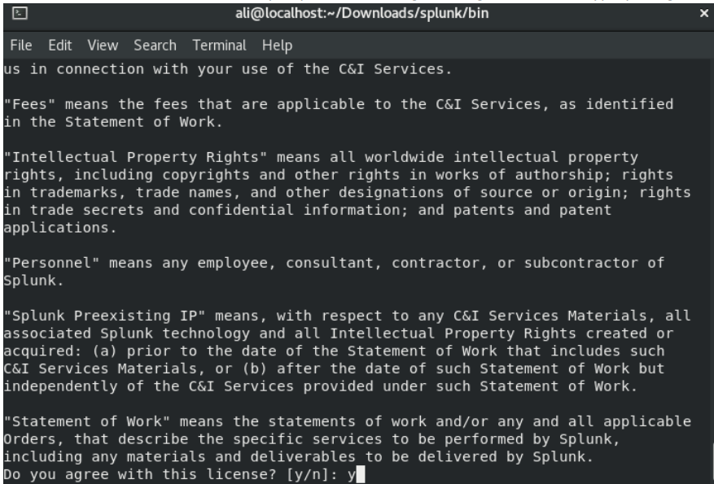 alt="A screenshot of a computer Description automatically generated" />

4.  Set Up Splunk Admin:

- Choose an administrator username and password.

> 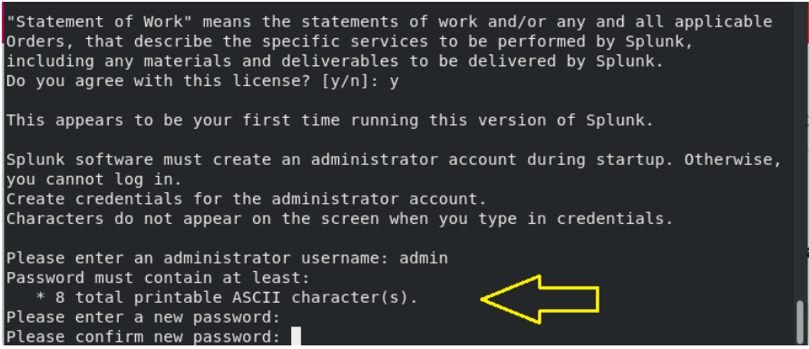 style="width:5.90144in;height:0.84325in" />

5.  Access Splunk Web Interface:

- Open your browser and go to the given IP address

> 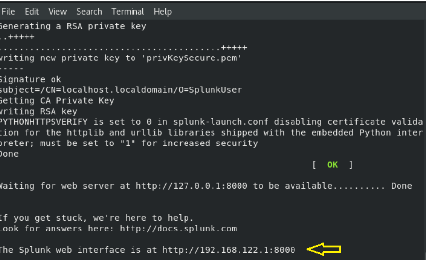 alt="A screenshot of a computer Description automatically generated" />

- Log in with the credentials you set up.

## Setting a Static IP Address on Ubuntu Server Using Wi-Fi

1.  **Open Wi-Fi Settings:**

    - Click on the network icon at the top right of the screen.

    - Select your Wi-Fi network (e.g., home).

    - Click the gear icon next to the network name.

2.  **Change IP Settings:**

    - Go to the IPv4 tab.

    - Change the method from Automatic (DHCP) to Manual.

3.  **Enter IP Details:**

    - **Address:** Enter your desired static IP address, e.g.,
      192.168.5.1.

    - **Netmask:**

      - Open a terminal and run: ifconfig.

      - Find your wireless interface (e.g., wlp2s0) and locate the
        netmask value, typically shown in CIDR notation (e.g., /24).

      - Convert the CIDR notation to a netmask format. For /24, the
        netmask is 255.255.255.0.

    - **Gateway:** Enter the gateway address, e.g., 192.168.5.254.

    - **DNS:**

      - Turn off the automatic toggle button.

      - Enter the DNS server addresses: 8.8.8.8, 8.8.4.4.

4.  **Apply Settings:**

    - Click Apply to save the changes.

5.  **Verify the Static IP:**

    - Turn off and then turn on your Wi-Fi to apply the new settings.

    - Check your IP address using the terminal with: ip a.

    - Confirm that the IP address is set to 192.168.5.1 and remains
      fixed.

**Set Up Receiving on Splunk Server**

1.  **Navigate to Receiving Settings**:

    - From the main menu, go to **Settings**.

    - Click on **Forwarding and Receiving**.

> 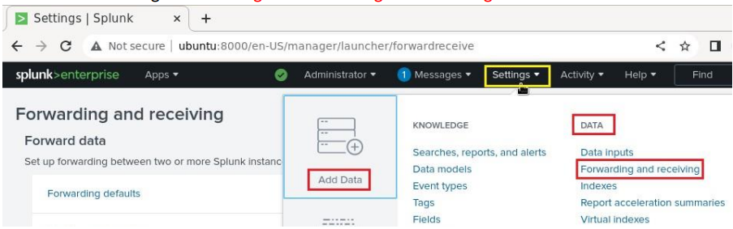 alt="A screenshot of a computer Description automatically generated" />

2.  **Configure Receiving**:

    - Under **Receive data**, click **Configure receiving**.

> 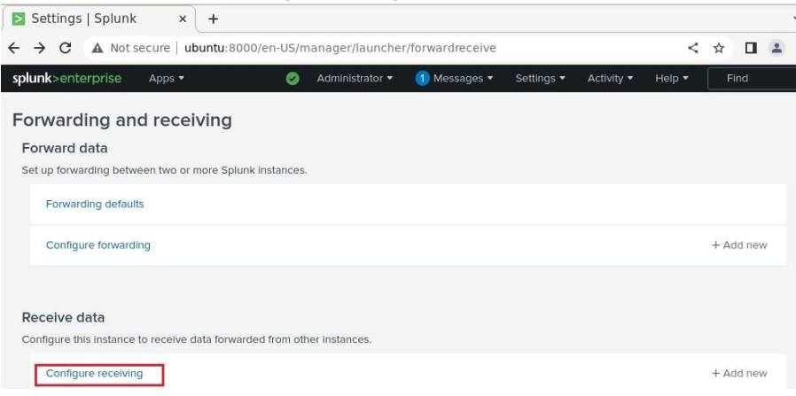 alt="A screenshot of a computer Description automatically generated" />

- Click **New Receiving Port** in the right corner.

> 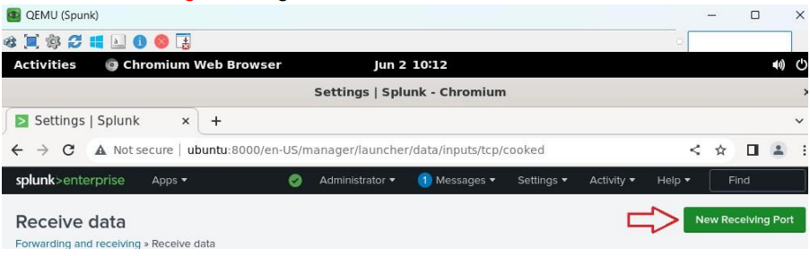 alt="A screenshot of a computer Description automatically generated" />

- Enter **9997** as the port number and click **Save**.

> 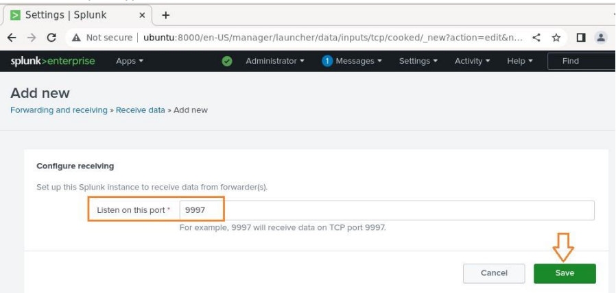 alt="A screenshot of a computer Description automatically generated" />

## Set Up Index on Splunk Server

1.  **Navigate to Indexes**:

    - From the main menu, go to **Settings**.

    - Click on **Indexes**.

> 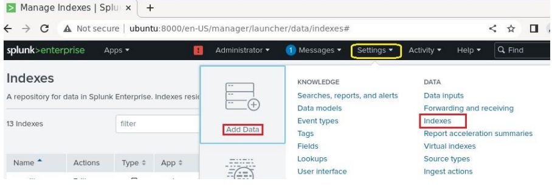 alt="A screenshot of a computer Description automatically generated" />

2.  **Create New Index**:

    - Click **New Index** in the right corner.

> 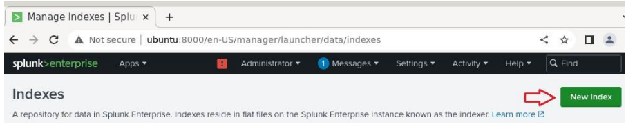 alt="A screenshot of a computer Description automatically generated" />

- Enter **winsrvlogs** as the index name and click **Save**.

> 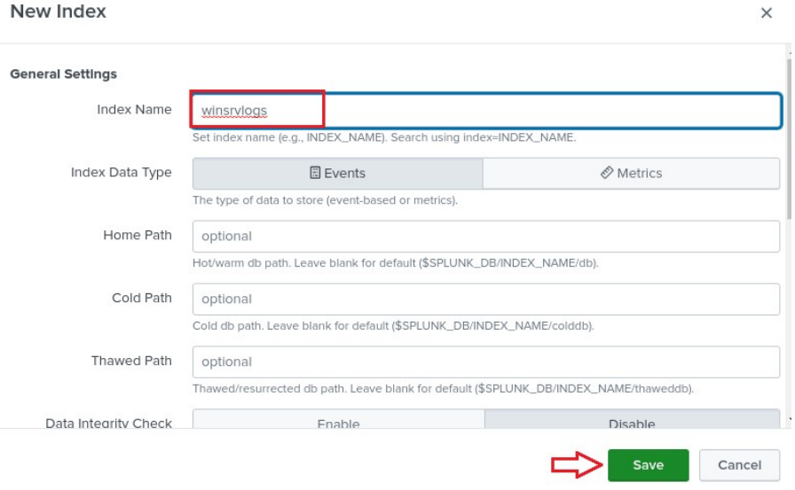 alt="A screenshot of a computer Description automatically generated" />

3.  **Verify Index Creation**:

    - Ensure that the index **winsrvlogs** has been created
      successfully.

# Install Splunk Forwarder on Windows

## Downloading Splunk Universal Forwarder on Windows 2011

1.  **Download Splunk Universal Forwarder**:

    - Go to Splunk Universal Forwarder Download.

> 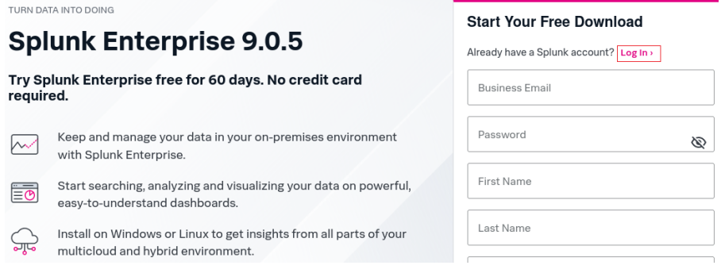 alt="A screenshot of a credit card Description automatically generated" />

- Log in or create an account if needed.

> 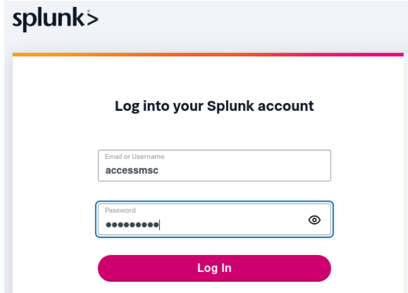 alt="A screenshot of a login box Description automatically generated" />

- Click on **Windows** and then click **Download Now**.

> 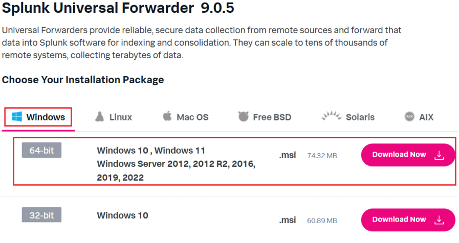 alt="A screenshot of a computer Description automatically generated" />

- The file will download to your **Downloads** folder.

2.  **Start Installation**:

    - Double-click the downloaded installer file to begin the
      installation.

    - On the Setup page, you can choose to accept the default options or
      customize them.

> 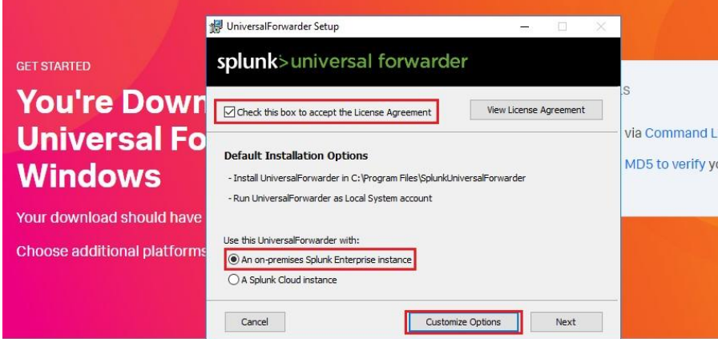 alt="A screenshot of a computer Description automatically generated" />

3.  **Configure Installation**:

    - By default, the Universal Forwarder will install to: C:\Program
      Files\SplunkUniversalForwarder\\

> 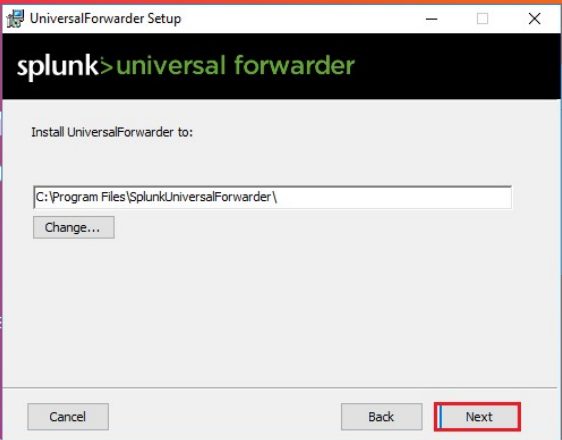 alt="A screenshot of a computer Description automatically generated" />

- It will use the local system account and collect Application, System,
  and Security Windows Event logs.

- Choose **Use this Universal Forwarder with an on-premises Splunk
  Enterprise instance** and click **Next**.

> 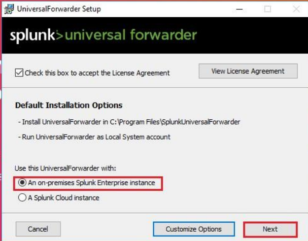 alt="A screenshot of a computer Description automatically generated" />

4.  **Enter Deployment and Indexer Details**:

    - Enter the **username** and **password** for the Splunk deployment
      server and click **Next**.

> 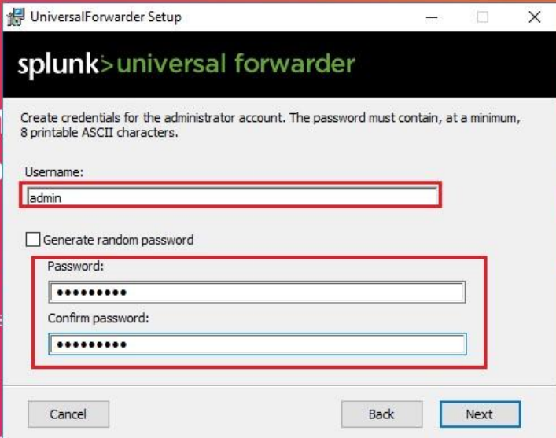 style="width:5.77767in;height:2.85792in" />

- Enter the **hostname or IP address** and **management port** (default
  is **8089**) for the deployment server.

> 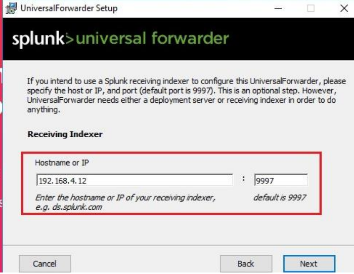 style="width:5.75214in;height:2.45332in" />

- Enter the **hostname or IP address** and **receiving port** (default
  is **9997**) for the Splunk indexer.

5.  **Complete Installation**:

    - Click **Install** to begin the installation process.

> 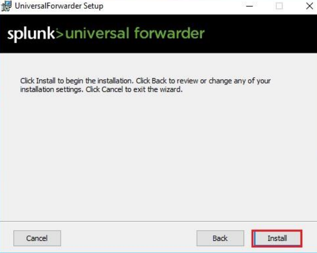 alt="A screenshot of a computer Description automatically generated" />

- Once the installation is complete, the Splunk Universal Forwarder
  should start automatically.

# Configure Forwarding on Splunk Server (Ubuntu)

1.  **Navigate to Add Data**:

    - From the main menu, go to **Settings**.

    - Click on **Add Data**.

> 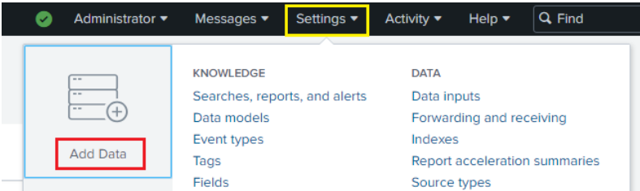 alt="A screenshot of a computer Description automatically generated" />

2.  **Configure Data Source**:

    - Select the **Domain Controller (Windows Server)** from the list.

    - Enter a **Server Class Name**, e.g., Domain Controller.

    - Click **Next**.

> 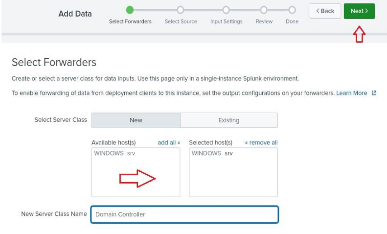 alt="A screenshot of a computer Description automatically generated" />

3.  **Select Event Logs**:

    - Choose **Local Event Logs**.

    - Select the desired event logs you wish to forward.

    - Click **Next**.

> 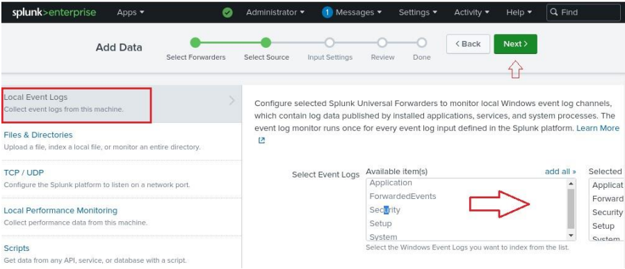 style="width:5.63327in;height:2.43156in" />

4.  **Assign Index**:

    - Choose **winsrvlogs** as the index for the logs.

    - Click **Review**.

> 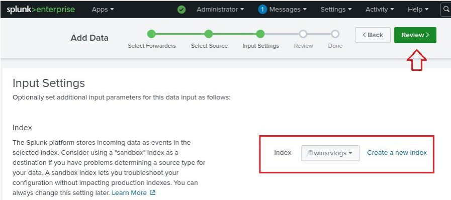 alt="A screenshot of a computer Description automatically generated" />

5.  **Submit Configuration**:

    - Review your settings.

    - Click **Submit** to complete the configuration.

    - Click Search

> 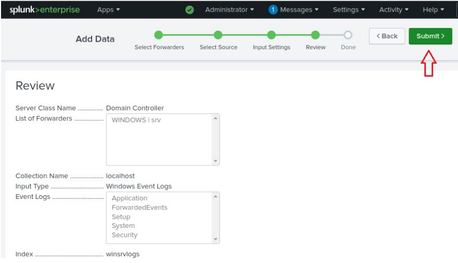 alt="A screenshot of a computer Description automatically generated" />
>
> 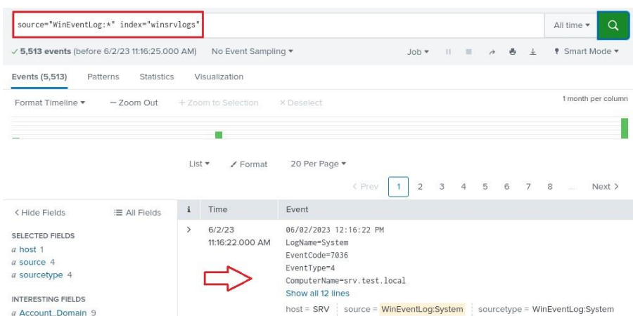 style="width:5.72031in;height:2.86015in" />

# Wazuh Installation

## Download and install on VM

1.  **Download Wazuh OVA File**:

    - Download the Wazuh Open Virtual Appliance (.OVA) from the [Wazuh
      Documentation](https://documentation.wazuh.com/current/deployment-options/virtual-machine/virtual-machine.html).

2.  **Unzip the Downloaded File**:

    - Use 7-Zip to unzip Wazuh-4.4.4.tar.

> 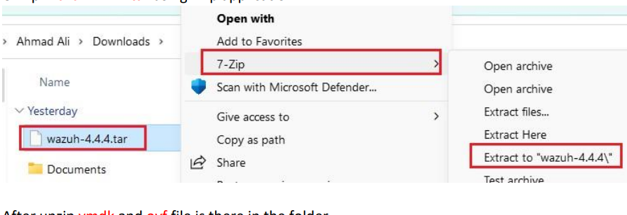 alt="A screenshot of a computer Description automatically generated" />

- After unzipping, locate the vmdk and ovf files in the folder.

> 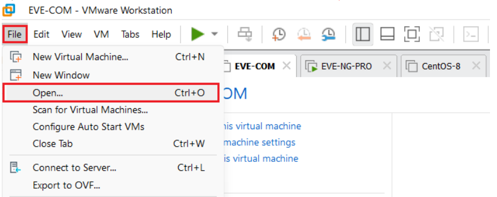 style="width:5.76229in;height:2.28168in" />

3.  **Import OVA into VMware Workstation**:

    - Open VMware Workstation Pro.

    - Go to **File** \> **Open…**.

    - Navigate to the unzipped folder and select Wazuh-4.4.4.ovf.

    - Click **Open**.

>  alt="A screenshot of a computer Description automatically generated" />

- Name the virtual machine (e.g., **Wazuh**) and choose the storage
  path.

> 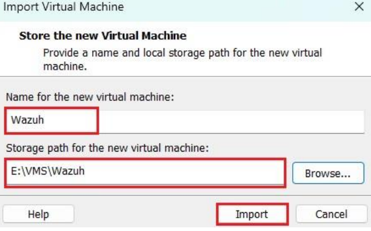 alt="A screenshot of a virtual machine Description automatically generated" />

- Click **Import** to start the importing process. This may take some
  time.

4.  **Adjust Network Settings**:

    - After import, open the virtual machine settings.

    - Change the **Network Adapter** setting to **NAT** and click
      **OK**.

> 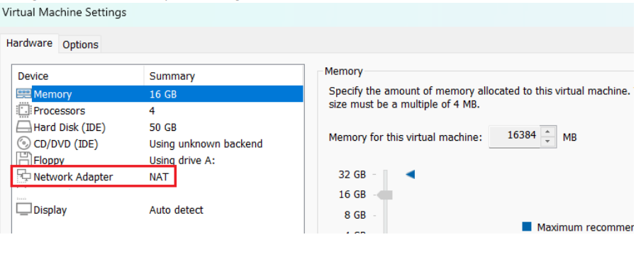 style="width:5.87469in;height:1.74795in" />

5.  **Power On the Virtual Machine**:

    - Click **Power on this virtual machine**.

6.  **Log In to Wazuh**:

    - Use the default credentials:

      - **User**: Wazuh-user

      - **Password**: wazuh

> 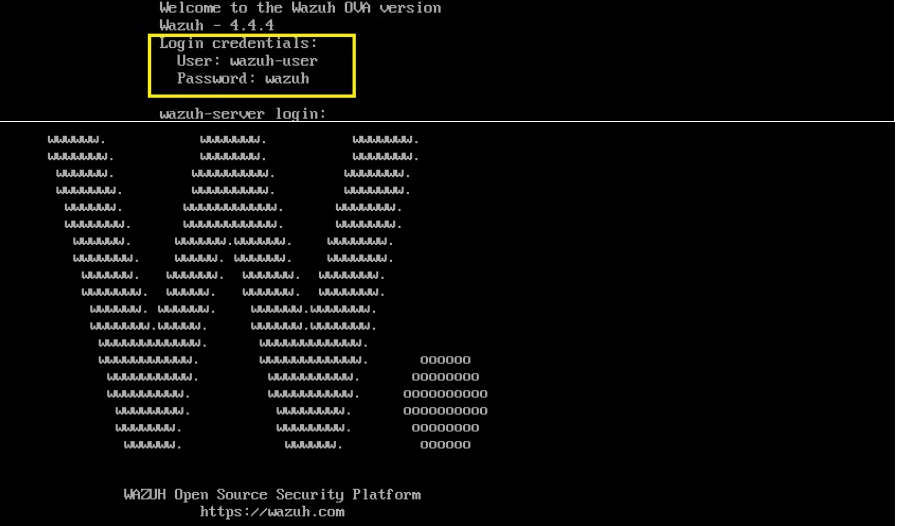 alt="A screenshot of a computer Description automatically generated" />

7.  **Verify IP Address**:

    - Open the terminal and run: ip addr

> 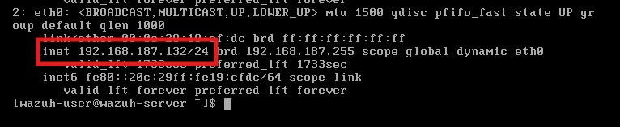 style="width:5.63264in;height:1.15448in"
> alt="A computer screen with white text Description automatically generated" />

8.  **Assign a Static IP Address (Optional)**:

    - Edit the network configuration file with: sudo vi
      /etc/sysconfig/network-scripts/ifcfg-eth0

    - Restart the network service using: sudo systemctl restart network

9.  **Access Wazuh Web Interface**:

    - Open your web browser.

    - Enter the IP address of your Wazuh server.

    - If you see a security warning, click **Advanced** and then
      **Accept the Risk** or **Proceed**.

    - Log in with:

      - **Username**: admin

      - **Password**: admin

> 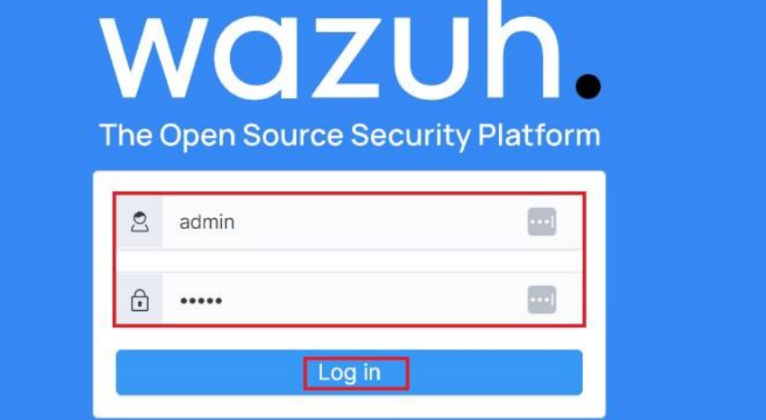 style="width:4.86803in;height:2.67186in" />

## WAZUH Agent Configuration

1.  **Download Wazuh Agent for Windows**:

    - Download the Wazuh Agent from the Wazuh Documentation.

> 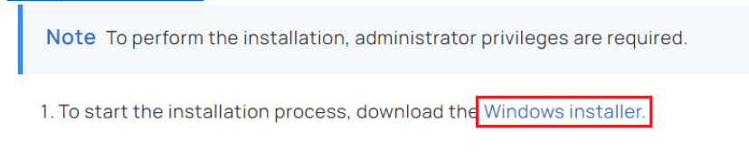 alt="A screenshot of a computer Description automatically generated" />

2.  **Install Wazuh Agent**:

    - After downloading, click on the installer to begin installation on
      Windows Server 2019.

    - Click **Install** to start the Wazuh Agent setup.

> 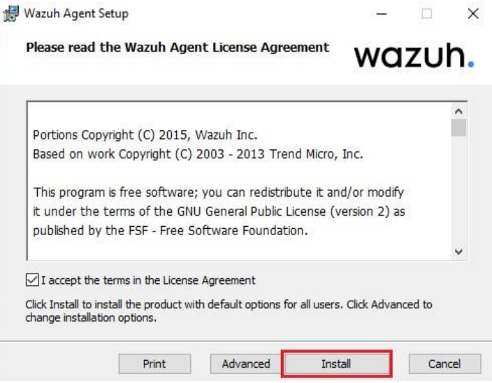 style="width:5.75105in;height:2.54413in" />

- Tick **Run Agent configuration interface** and click **Finish**.

> 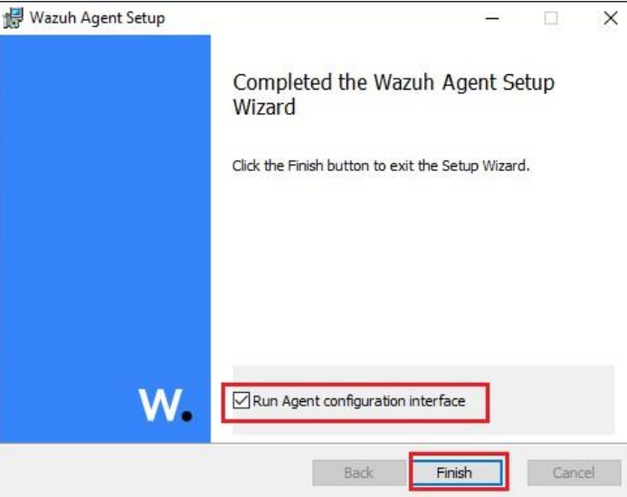 alt="A screenshot of a computer Description automatically generated" />

3.  **Configure Wazuh Agent**:

    - Open **Manage Agent** from the startup program.

> 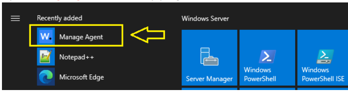 alt="A yellow arrow on a black background Description automatically generated" />

- Enter the IP Address of the Wazuh Manager, e.g., 192.168.187.132 and
  click save

> 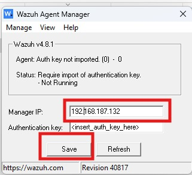 style="width:3.26389in;height:2.94205in"
> alt="A screenshot of a computer Description automatically generated" />

4.  **Authenticate Wazuh Agent**:

    - Open **Windows PowerShell** and run as administrator.

> 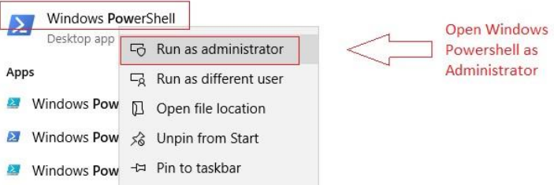 alt="A screenshot of a computer Description automatically generated" />

- Navigate to the Wazuh agent directory location:

  - Type cd 'C:\Program Files (x86)' and press Enter.

  - Type cd .\ossec-agent\\ and press Enter.

  - Type .\\agent-auth.exe -m 192.168.187.132 and press Enter.

> 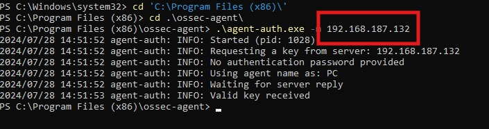 style="width:5.28889in;height:1.39517in"
> alt="A screen shot of a computer program Description automatically generated" />

- After running the above commands, go back to the Wazuh Agent Manager
  and restart to get the Authentication key.

> 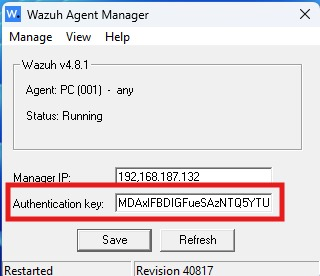 alt="A screenshot of a computer Description automatically generated" />

5.  **Verify Agent Configuration**:

    - Go to the Wazuh Manager and verify that the agent is configured
      successfully.

> 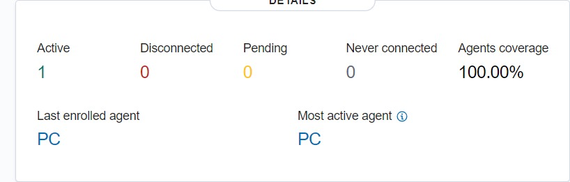 style="width:5.43973in;height:1.77361in"
> alt="A screenshot of a computer Description automatically generated" />

## Adding a Wazuh Agent using the Wazuh Manager Console

1.  **Access Wazuh Manager Console**:

    - Open your web browser.

    - Enter the IP address of your Wazuh Manager.

    - Log in with your Wazuh Manager credentials.

2.  **Navigate to Agent Management**:

    - From the main menu, go to **Agents**.

    - Click on **Add agents**.

3.  **Select Operating System**:

    - Choose your operating system (e.g., Linux).

4.  **Generate Registration Command**:

    - The Wazuh Manager will display a registration command. It will
      look similar to this:

      - sudo WAZUH_MANAGER='192.168.187.132 ' /var/ossec/bin/agent-auth
        -m 192.168.187.132

    - Copy the registration command.

5.  **Execute Registration Command on Linux Machine**:

    - Open a terminal on your Linux machine.

    - Paste and execute the registration command:

      - Type sudo WAZUH_MANAGER= '192.168.187.132 '
        /var/ossec/bin/agent-auth -m 192.168.187.132 and press Enter.

6.  **Restart Wazuh Agent**:

    - Restart the Wazuh agent service to apply the changes:

      - Type sudo systemctl restart wazuh-agent and press Enter.

7.  **Verify Agent Configuration**:

    - Return to the Wazuh Manager console.

    - Go to **Agents** \> **Manage agents**.

    - Verify that the new agent appears in the list and is active.

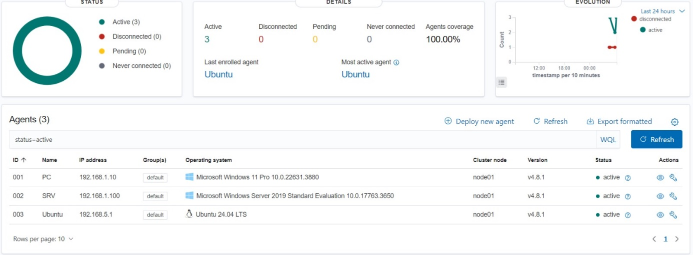

# Testing Set-Up

## Testing Splunk and Wazuh with Brute Force Attacks on Windows 11 and Active Directory

After conducting tests to verify the integration and functionality of
Splunk and Wazuh, it has been confirmed that both platforms successfully
detected and alerted on brute force attacks targeting a Windows 11
client and a Windows Server 2019 Active Directory (AD) setup. Here is a
concise summary of the test process and outcomes:

### Test Setup

1.  **Environment Configuration**:

    - **Splunk** was configured to receive and index security logs from
      both the Windows 11 machine and the Windows Server 2019 AD domain
      controller.

    - **Wazuh Agent** was installed on both machines, with the Wazuh
      Manager set up to monitor and generate alerts for suspicious
      activities.

2.  **Isolated Test Network**:

    - An isolated test environment was created to ensure that the tests
      did not impact production systems.

### Brute Force Attack Simulation

1.  **Target User Accounts**:

    - Specific user accounts were created on both Windows 11 and the AD
      domain controller to serve as targets for the simulated brute
      force attacks.

2.  **Execution of Brute Force Attacks**:

    - Tools like **Hydra** and **Ncrack** were used to simulate brute
      force attacks. These tools repeatedly attempted to authenticate
      with different passwords to test the systems' ability to detect
      the attacks.

> Command Line for (Hydra)
>
> hydra -L users.txt -P passwords.txt 192.168.1.20 rdp
>
> Replace the IP address with the domain controller's IP

### Monitoring and Detection

1.  **Wazuh Monitoring**:

    - The Wazuh Manager dashboard successfully identified and alerted on
      multiple failed login attempts and other suspicious activities.

2.  **Splunk Analysis**:

    - Splunk captured detailed logs of the events, including the
      specific EventCode for failed login attempts (4625). Custom
      dashboards and alerts provided real-time visibility into the
      attack patterns.

> Splunk Query:
>
> index=windows sourcetype="WinEventLog:Security" EventCode=4625

### Results and Verification

- **Alerts and Logs**:

  - Both Splunk and Wazuh accurately captured and reported the brute
    force attack activities. Alerts were promptly generated,
    demonstrating the effectiveness of the monitoring setup.

- **System Response**:

  - The systems responded as expected, with logs and alerts reflecting
    the nature of the simulated attacks.

### Test Outcome

The test confirmed that Splunk and Wazuh are effectively integrated and
capable of detecting and alerting on brute force attacks. The detection
mechanisms were timely and accurate, ensuring robust monitoring and
security for the systems involved. The setup can be further refined
based on specific security needs and evolving threat landscapes.

# Conclusion

The Cyber Security Monitoring & Detection Sandbox provides a
comprehensive and practical environment for exploring and understanding
various cyber security measures. This project has successfully
demonstrated the setup and configuration of a simulated network
environment using VMware Workstation Pro, incorporating essential
components such as firewalls, intrusion detection systems, log
management solutions, and attacker simulations. By leveraging tools like
pfSense, Wazuh, Splunk, and Kali Linux, this sandbox offers invaluable
hands-on experience in real-time threat detection, automated incident
response, network traffic analysis, and user activity monitoring.

This lab environment not only facilitates the learning of security
practices but also serves as a robust platform for testing and refining
cyber defense strategies. The integration with SIEM systems and the use
of machine learning for anomaly detection underscore the project's
relevance in tackling modern cyber threats.

As we move forward, this setup will be a vital resource for future
projects, enabling the simulation of various incident attack scenarios
and the development of effective mitigation techniques. The flexible
architecture allows for continuous updates and enhancements, ensuring
that the sandbox remains aligned with the evolving landscape of cyber
security. By fostering a deeper understanding of security operations,
this project lays a solid foundation for future explorations and
innovations in the field of cyber security.
